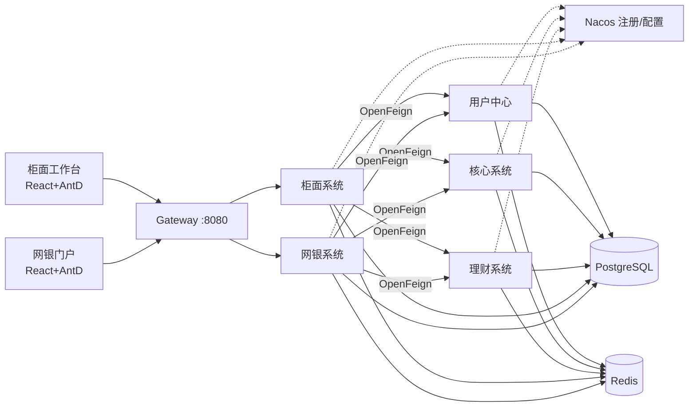

<h1 align="center">🏦 AirBank 云端模拟银行</h1>

<p align="center">
  基于 Spring Cloud 微服务架构的<b>分布式模拟银行系统</b><br />
  面向测试工具验证、人员培训、业务演示的一体化银行仿真环境
</p>

> **当前状态：详细设计阶段** —— 全套设计文档已完成，见 [文档导航](#-文档导航)。代码实施将按
> [12-工程规范与实施计划](docs/design/12-工程规范与实施计划.md) 中的里程碑推进。

## 一句话定位

AirBank 用 **5 个 Spring Cloud 微服务 + 2 个 React 前端**完整模拟一家银行：核心账务（复式记账、存取转、利息、日终批量）、
理财（产品募集、申赎、收益计提、到期清算）、用户中心（客户/柜员/权限）、以及 **柜面** 与 **网上银行** 两个端到端业务渠道。
全套系统通过 **Docker Compose 一键部署**，Nacos 作为注册中心与配置中心，PostgreSQL 存储，行业最佳实践的企业级工程结构。

## 服务清单

| 服务 | 说明 | 端口 |
|---|---|---|
| `airbank-gateway` | Spring Cloud Gateway 统一接入：鉴权、路由、限流 | 8080 |
| `airbank-core` | **核心系统**：账户、存取款、转账、复式记账引擎、利息、日终批量 | 8081 |
| `airbank-wealth` | **理财系统**：产品管理、申购/赎回、份额、收益计提、到期清算 | 8082 |
| `airbank-uam` | **用户中心**：客户主数据、认证（JWT）、柜员/角色/权限、机构 | 8083 |
| `airbank-counter` | **柜面系统**：柜员工作台后端、业务受理、复核授权、尾箱、日结 | 8084 |
| `airbank-ebank` | **网上银行**：客户自助服务后端、转账、理财超市、回单、消息 | 8085 |
| `airbank-counter-web` | 柜面工作台前端（React + Ant Design Pro 布局） | 8001 |
| `airbank-ebank-web` | 网银门户前端（React + Ant Design） | 8002 |
| `nacos` | 注册中心 + 配置中心 | 8848 |
| `postgres` | PostgreSQL 16（database-per-service，5 个独立库） | 5432 |
| `redis` | 验证码、幂等预检、分布式锁、缓存 | 6379 |
| `zipkin` 等 | 链路追踪 / Prometheus / Grafana / Loki（可观测性 profile） | 9411/9090/3000/3100 |

## 架构速览



核心业务闭环示例（完整流程见设计文档）：
**柜面开户 → 现金存款 → 网银注册绑定 → 网银转账 → 网银申购理财 → 日终计提收益 → 到期清算入账 → 柜员日结轧账**。

## 📚 文档导航

全部详细设计位于 [`docs/design/`](docs/design/)，按阅读顺序：

| # | 文档 | 内容 |
|---|---|---|
| 01 | [项目概述与需求](docs/design/01-项目概述与需求.md) | 背景目标、用户角色、P0/P1/P2 功能清单、术语表 |
| 02 | [总体架构设计](docs/design/02-总体架构设计.md) | 架构原则、服务拆分、技术选型与版本矩阵、模块划分、服务通信、Nacos 设计、事务一致性 |
| 03 | [核心系统业务设计](docs/design/03-核心系统业务设计.md) | 客户/账户模型、会计科目与复式记账引擎、存取转/定期流程、利息、日终批量、编号规则 |
| 04 | [理财系统业务设计](docs/design/04-理财系统业务设计.md) | 产品生命周期与状态机、申购/赎回/清算全流程、份额与收益、与核心的资金交互与对账 |
| 05 | [用户中心与渠道设计](docs/design/05-用户中心与渠道设计.md) | 认证授权（JWT/RBAC/验证码/OTP）、柜面受理-复核授权-尾箱-日结、网银全功能、端到端场景 |
| 06 | [数据模型设计](docs/design/06-数据模型设计.md) | 5 库规划、各域 ER 图、全部表结构（字段/类型/约束/索引） |
| 07 | [接口设计与规范](docs/design/07-接口设计与规范.md) | REST 规范、统一响应/分页/错误码全表、幂等设计、各服务 API 清单 |
| 08 | [安全与非功能设计](docs/design/08-安全与非功能设计.md) | 认证鉴权、数据加密与脱敏、审计、容错降级、可观测性（追踪/日志/指标） |
| 09 | [容器化部署设计](docs/design/09-容器化部署设计.md) | Compose 拓扑、健康检查与启动依赖、Nacos/PG 初始化、profiles、环境变量 |
| 10 | [前端设计](docs/design/10-前端设计.md) | 工程结构、柜面工作台/网银门户信息架构与页面清单、关键交互、视觉规范 |
| 11 | [测试与培训场景库](docs/design/11-测试与培训场景库.md) | 演示账号、14 个端到端场景（步骤/预期/校验点）、故障演练、造数与压测 |
| 12 | [工程规范与实施计划](docs/design/12-工程规范与实施计划.md) | 仓库结构、Maven 模块、代码/分支/提交规范、测试策略、里程碑 |

## 快速开始（实施完成后）

```bash
git clone <repo> && cd AirBank
mvn -f pom.xml clean package -DskipTests      # 构建后端镜像
pnpm -r build                                  # 构建两个前端
docker compose -f deploy/compose/docker-compose.yml --profile full up -d
# 柜面工作台  http://localhost:8001   （柜员 990001 / Abc12345）
# 网银门户    http://localhost:8002   （客户 zhangsan / Abc12345）
# Nacos 控制台 http://localhost:8848/nacos  (nacos / nacos)
# Grafana    http://localhost:3000   （--profile observability）
```

> 以上演示账号与初始数据由 `deploy/postgres/init` 种子脚本自动创建，仅限培训/测试环境使用。

## 目标读者

- **测试工程师**：用真实业务流验证自动化工具（API/UI/性能），配套[场景库](docs/design/11-测试与培训场景库.md)与造数工具。
- **培训讲师/新员工**：在沙箱中演练柜面、网银、理财全流程，可反复操作、随时重置。
- **架构/开发人员**：Spring Cloud + Nacos + PostgreSQL + Docker 的企业级参考实现。
