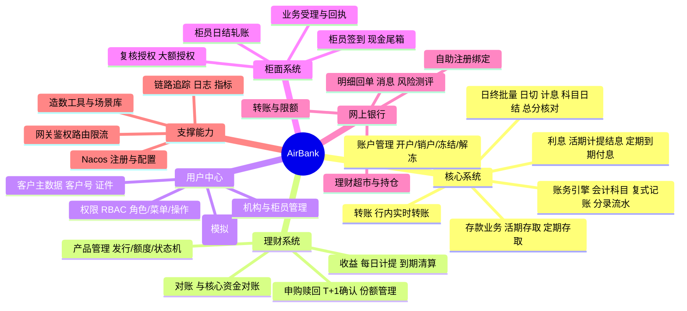

# 01 · 项目概述与需求

> AirBank 详细设计 · 版本 v1.0 · 2026-09

## 1. 背景

测试工具验证、人员培训、业务演示等活动中，经常需要一个**真实度高、可反复操作、可随时重置**的银行系统环境。
对接真实银行系统存在数据安全、操作风险、环境稳定性等问题。AirBank 旨在以微服务架构完整仿真一家商业银行，
覆盖"核心账务 + 理财 + 用户中心 + 柜面 + 网上银行"五大域，并提供端到端业务闭环。

## 2. 项目目标

| 目标 | 说明 |
|---|---|
| **真实性** | 业务规则贴近真实银行：复式记账、会计科目、授权复核、限额控制、日终批量、总分校验、理财 T+1 确认等 |
| **完整性** | 端到端闭环：柜面开户 → 存款 → 网银使用 → 理财 → 日终清算 → 轧账，每个环节都有账务留痕 |
| **易用性** | 前端美观（Ant Design 5）、操作引导清晰、一键部署（Docker Compose）、预置演示数据 |
| **可验证性** | 提供场景库、造数工具、故障注入点、完整 API 文档（OpenAPI），支撑测试工具验证与自动化 |
| **示范性** | 采用企业级 Java 工程最佳实践，可作为微服务架构的教学参考实现 |

### 非目标（Non-Goals）

- 不对接任何真实外部系统（网联/银联/人行支付系统），跨行转账以"行内"语义模拟。
- 不追求生产级高可用（Nacos/PG 单实例），但架构保留扩展路径。
- 不包含信贷、对公、外汇、票据等业务域（预留扩展，见 §7 演进路线）。
- 不满足真实金融监管合规要求（如加密机、密评），安全设计以"培训环境够用 + 实践示范"为度。

## 3. 用户角色

| 角色 | 使用入口 | 典型操作 |
|---|---|---|
| **系统管理员** admin | 柜面工作台（管理菜单） | 机构/柜员/角色管理、产品上架、参数配置、批量触发、造数 |
| **柜员**（普通柜员） | 柜面工作台 | 签到/签退、开户、存取款、转账、受理理财、销户、日结 |
| **主管**（授权柜员） | 柜面工作台 | 复核授权大额业务、柜员管理、日终审核 |
| **个人客户** | 网银门户 | 注册登录、查询、转账、买/赎理财、电子回单、风险测评、限额设置 |
| **测试/培训人员** | API / 前端 / 造数工具 | 按场景库执行端到端验证、造数、故障演练、压测 |

## 4. 业务范围总览

## 5. 功能清单（P0 / P1 / P2）

P0 = 首版必须；P1 = 首版尽量包含（设计已覆盖）；P2 = 二期演进。
详细业务规则见 03/04/05 号设计文档，接口粒度见 07 号文档。

### 5.1 用户中心（airbank-uam）

| 功能 | 优先级 | 说明 |
|---|---|---|
| 客户建立/查询/修改 | P0 | 柜面录入客户信息（姓名、证件、手机号），生成客户号 |
| 柜员/机构/角色/权限管理 | P0 | RBAC：用户-角色-菜单/操作权限；柜员归属机构 |
| 柜面登录（工号+密码+图形验证码） | P0 | 签发 JWT，控制 登录失败锁定 |
| 网银客户注册绑定 | P0 | 已有客户 + 预留手机号 OTP 校验后自助注册 |
| 网银登录 | P0 | 登录名/手机号 + 密码 + 图形验证码 |
| 短信 OTP（模拟） | P0 | 验证码落库到消息中心/日志，页面可"查看"，替代真实短信 |
| 密码修改/重置 | P0 | 柜面重置客户密码；自助修改需原密码 |
| 风险测评问卷 | P1 | 5 题 → C1~C5 等级，理财准入依据 |
| 登录日志/操作审计 | P1 | 见 08 安全设计 |

### 5.2 核心系统（airbank-core）

| 功能 | 优先级 | 说明 |
|---|---|---|
| 开户（活期）/销户 | P0 | 生成账号/卡号，首笔入账激活 |
| 账户冻结/解冻/止付 | P0 | 冻结账户拒绝出金类交易 |
| 现金存款/取款 | P0 | 柜面渠道，联动柜员尾箱 |
| 行内转账 | P0 | 实时到账，幂等防重，余额不足/冻结拒绝 |
| 活期利息：每日计提 + 季度结息 | P0 | 年利率参数化，360 天基 |
| 定期存款（整存整取）：存入/到期兑付/提前支取 | P0 | 到期自动兑付（批量），提前支取按活期计息 |
| 复式记账引擎 | P0 | 会计科目、借贷分录、业务流水关联 |
| 日终批量：日切/计息/科目日结/总分核对 | P0 | 可定时可手动触发，产出日结报表 |
| 交易流水查询/账户明细 | P0 | 渠道与核心均可见 |
| 转账冲正 | P1 | 柜面当日差错冲正（反向分录） |
| 定期部分提前支取 | P2 | 仅全额支取 v1 |
| 净值型理财核算 | P2 | v1 采用预期收益率型产品 |

### 5.3 理财系统（airbank-wealth）

| 功能 | 优先级 | 说明 |
|---|---|---|
| 产品管理（发行/上架/停售） | P0 | 预期收益率型：期限、业绩基准、风险等级、起购金额、募集额度 |
| 申购（柜面/网银） | P0 | 实时扣款至"代理理财资金"，T+1 确认份额 |
| 赎回（柜面/网银） | P0 | T+1 确认，本金+已计提收益回活期账户 |
| 份额/持仓管理 | P0 | 客户-产品持仓，成本与累计收益 |
| 每日收益计提 | P0 | 本金 × 业绩基准 ÷ 360，起息日 T+1 |
| 到期自动清算 | P0 | 批量生成兑付指令，调核心入账，幂等可重跑 |
| 产品额度控制 | P1 | 募集上限售罄拒单 |
| 与核心资金对账 | P1 | 代理理财资金科目余额 = 存续持仓本金合计 |
| 净值型产品、定开产品 | P2 | |

### 5.4 柜面系统（airbank-counter）

| 功能 | 优先级 | 说明 |
|---|---|---|
| 柜员签到/签退、现金尾箱 | P0 | 尾箱余额随现金收付变动，限额控制 |
| 业务受理：开户/存取/转账/定期/理财/销户 | P0 | 统一"业务申请单"模式，核心/理财落账 |
| 大额授权复核 | P0 | 单笔 ≥ ¥50,000 需主管复核授权后执行 |
| 回执打印（PDF 预览） | P1 | 每笔业务生成回执单 |
| 柜员日结 | P0 | 笔数/金额轧账、尾箱核对、日结单 |
| 当日差错冲正 | P1 | 反向分录冲正，留痕 |
| 业务申请单草稿/待复核队列 | P1 | 先受理后复核的两段式 |

### 5.5 网上银行（airbank-ebank）

| 功能 | 优先级 | 说明 |
|---|---|---|
| 自助注册绑定账户 | P0 | 客户号/卡号 + 预留手机 OTP |
| 资产总览首页 | P0 | 存款+理财资产汇总、最近交易 |
| 行内转账 + 收款人名册 | P0 | 限额控制、OTP 二次确认 |
| 账户明细/交易查询（导出 CSV） | P0 | |
| 理财超市/申购/赎回/持仓/交易记录 | P0 | 风险等级匹配提示与拦截 |
| 电子回单 | P1 | 转账/申赎回单查询与下载 |
| 个人限额设置 | P1 | 仅允许调低；调高需 OTP |
| 消息中心 | P1 | OTP、交易通知、批量结果通知 |
| 挂失/冻结申请 | P2 | 转柜面处理 |

### 5.6 平台支撑

| 功能 | 优先级 | 说明 |
|---|---|---|
| 网关：路由/统一鉴权/限流 | P0 | JWT 校验、白名单、Sentinel 限流 |
| Nacos 注册中心 + 配置中心 | P0 | 服务发现、配置分级（公共+服务级）、动态刷新 |
| 链路追踪/统一日志/指标 | P0 | Micrometer Tracing→Zipkin；JSON 日志→Loki；Actuator→Prometheus→Grafana |
| 数据初始化与种子数据 | P0 | Compose 首启自动建库建表灌数，开箱即用 |
| 造数工具（data factory） | P0 | dev profile 开放：批量生成客户/账户/流水 |
| 一键重置环境 | P1 | compose down -v 后重启即恢复种子状态 |
| 性能压测脚本 | P1 | JMeter 场景（登录/转账/查询） |

## 6. 术语表

| 术语 | 定义 |
|---|---|
| 客户（Customer） | 在银行建立档案的自然人，持有客户号；可拥有多个账户 |
| 账户（Account） | 存款账户，挂接会计科目下的明细余额；分活期/定期 |
| 尾箱（Cash Box） | 柜员名下现金头寸台账，现金收付同步变动，日结必须轧平 |
| 会计科目（GL Subject） | 总账核算科目，如 1010 库存现金、2011 个人活期存款 |
| 分录（Journal Entry） | 复式记账的一条借贷记录，附属于某笔业务流水 |
| 总分核对 | 账户明细余额合计与总账科目余额的一致性校验 |
| 会计日期（batch_date） | 营业日期，日终批量以会计日期为准，支持日切 |
| T+1 确认 | 理财申赎在交易次日（工作日）确认份额/资金 |
| 业务申请单 | 柜面受理业务的统一载体：草稿 → 待复核 → 已执行/拒绝 |
| 授权（复核） | 大额/敏感业务需更高权限柜员二次确认后才能落账 |
| 冲正 | 对已入账差错的交易做反向分录 |
| OTP | 一次性短信验证码（本系统模拟发送，落消息中心） |
| UAM | User & Access Management，用户中心系统 |

## 7. 演进路线（二期候选）

对公账户与转账、跨行转账模拟（清算中心服务）、贷款/信用卡、净值型理财与估值、Seata 分布式事务示范、
Kubernetes/Helm 部署、国际化（i18n）、移动端 H5、自动化 E2E（Playwright）流水线。
