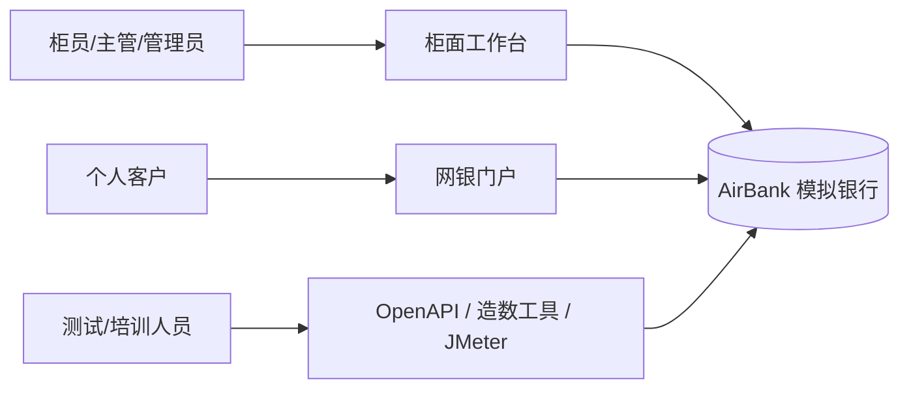
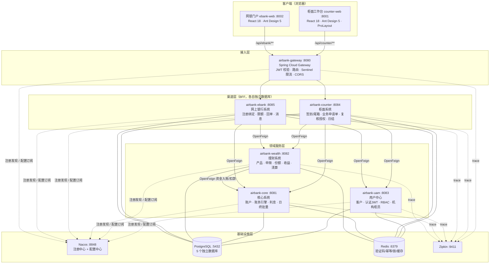

# 02 · 总体架构设计

> AirBank 详细设计 · 版本 v1.0

## 1. 架构原则

| 原则 | 落地方式 |
|---|---|
| **服务按业务域拆分** | 5 个业务服务按银行真实职能划分（核心/理财/用户/柜面/网银），而非按技术层拆分 |
| **数据库私有** | Database-per-Service：每个服务独占一个 PostgreSQL database，禁止跨库直查，跨域只走 API |
| **资金收敛** | 所有账务变动收敛在**核心系统单一事务**内完成；跨服务交互用"幂等 + 状态机 + 补偿"，不引入 Seata（理由见 §8） |
| **渠道薄、领域厚** | 柜面/网银是渠道 BFF：只做编排、鉴权、限额、留痕；账务规则全部在核心/理财内聚 |
| **配置外置** | 一切可变参数（利率、限额、开关）进 Nacos 配置中心，支持动态刷新，便于培训演练 |
| **约定优于配置** | 统一响应结构、统一错误码、统一幂等头、统一审计字段，收敛在 `airbank-common` |

## 2. 系统上下文



## 3. 逻辑架构



> 前端容器（nginx）同时承担静态资源服务与 `/api` 反向代理到网关，浏览器只见同源请求，规避 CORS。

### 调用关系约定

- **浏览器 → 网关 → 渠道服务**：唯一对外通道。柜面前端只访问 `/api/counter/**`，网银前端只访问 `/api/ebank/**`。
- **渠道 → 领域服务**：OpenFeign + Nacos 服务发现 + LoadBalancer，同步调用。
- **理财 → 核心**：资金变动（扣款/入账）由理财通过 Feign 调核心"统一记账接口"完成（幂等）。
- **领域服务之间不互相调用**（理财→核心是唯一例外，方向单一，无环）。
- 禁止领域服务直接调用渠道服务；消息通知以渠道轮询 + 站内消息表实现（简化，避免引入 MQ）。

> **为何不引入 MQ（RocketMQ/Kafka）**：v1 业务闭环均为同步语义（实时扣款/实时确认），同步 Feign + 状态机 + 补偿已可保证一致性，
> 引入 MQ 会显著抬高部署与教学成本。日终批量的跨系统任务（理财计提→核心入账）采用"清算指令表 + 幂等重跑"的准可靠消息模式，
> 在 04 号文档 §6 详述。二期演进再评估事件驱动。

## 4. 服务职责边界

| 服务 | 职责（ owning domain） | 明确不管 |
|---|---|---|
| airbank-gateway | 路由、JWT 存在性校验、限流、CORS、灰度入口 | 业务规则 |
| airbank-uam | 客户主数据、用户认证、RBAC、机构/柜员、OTP、风险测评 | 任何资金账务 |
| airbank-core | 账户生命周期、存/取/转/定期、会计科目与分录、利息、日终批量、总分校验 | 客户资料（引用 uam 客户号）、理财份额 |
| airbank-wealth | 理财产品、申赎订单、份额、收益计提、到期清算、理财对账 | 存款账户余额（变动必须经核心） |
| airbank-counter | 柜面渠道编排：签到/尾箱、业务申请单、复核授权、回执、日结 | 直接修改核心表 |
| airbank-ebank | 网银渠道编排：注册绑定、限额、转账/理财入口、回单、消息 | 直接修改核心表 |
| 前端两个应用 | 展示与交互 | 任何业务规则（全部信任后端） |

## 5. 技术选型与版本矩阵

| 分类 | 选型 | 版本 | 说明 |
|---|---|---|---|
| 语言/JDK | Java（Temurin） | 17 LTS | 记录类、文本块、sealed 用于模型与错误体系 |
| 微服务基座 | Spring Boot | 3.2.10 | |
| 微服务治理 | Spring Cloud | 2023.0.3 | Gateway 4.1 / OpenFeign / LoadBalancer |
| 阿里云扩展 | Spring Cloud Alibaba | 2023.0.1.3 | Nacos 2.3.2 客户端、Sentinel 1.8 |
| 注册/配置中心 | Nacos（standalone） | 2.3.2 | 单机内嵌存储；培训环境够用 |
| 网关 | Spring Cloud Gateway | 随 SC | WebFlux 全局过滤器 |
| ORM | MyBatis-Plus | 3.5.7 | 银行行业主流；乐观锁插件、逻辑删除、分页 |
| 数据库 | PostgreSQL | 16 | 5 个 database，schema `public` |
| 缓存 | Redis | 7.2 | 图形验证码、OTP、幂等预检、分布式锁（SETNX+Lua）、热点产品缓存 |
| 安全 | spring-security-crypto + jjwt | BCrypt / 0.12.6 | 密码 BCrypt；JWT HS256（密钥走 Nacos） |
| API 文档 | springdoc-openapi | 2.5.0 | 各服务暴露 Swagger UI，统一入口 `/api/{svc}/swagger-ui.html` |
| 批处理 | 自研轻量批量框架 | - | 批量任务表 + 分布式锁 + 断点续跑（见 03 §8） |
| 可观测 | Micrometer Tracing + Zipkin reporter | 1.2.x | W3C traceparent 贯穿 Feign/网关 |
| 构建 | Maven | 3.9 | 多模块 + `airbank-dependencies` BOM |
| 前端框架 | React + TypeScript | 18.3 / 5.5 | Vite 5 构建 |
| 组件库 | Ant Design | 5.21 | + `@ant-design/pro-components`（柜面 ProLayout） |
| 前端状态/路由 | zustand + react-router | 4.5 / 6.26 | axios 封装 + 拦截器 |
| 前端 Mock | msw | 2.x | 联调前可脱离后端演示 |
| 容器 | Docker + docker compose | v2 | 单机部署；多阶段构建镜像 |
| 压测 | Apache JMeter | 5.6 | 场景脚本随仓库交付 |

> 版本兼容性说明：SCA 2023.0.x ↔ SC 2023.0.x ↔ Boot 3.2.x ↔ JDK 17 为官方兼容矩阵；Nacos Server 2.3.x 与 SCA 2023.0.1.3 内置客户端匹配。

## 6. Maven 模块划分

```text
AirBank（父 POM，聚合 + dependencyManagement）
├── airbank-dependencies        # 三方依赖 BOM（仅 POM）
├── airbank-common              # 通用库：Result/错误码/分页/审计字段/工具/JWT 解析/Feign 解码器
├── airbank-api                 # 服务间契约（拆分包，见下）
│   ├── airbank-api-uam         # UamClient feign + DTO
│   ├── airbank-api-core        # CoreClient feign + DTO（记账/账户/流水）
│   └── airbank-api-wealth      # WealthClient feign + DTO
├── airbank-gateway             # 网关（可执行）
├── airbank-uam                 # 用户中心（可执行）
├── airbank-core                # 核心系统（可执行）
├── airbank-wealth              # 理财系统（可执行）
├── airbank-counter             # 柜面系统（可执行）
├── airbank-ebank               # 网上银行（可执行）
├── airbank-counter-web         # 柜面前端（pnpm 工作区子包）
└── airbank-ebank-web           # 网银前端
```

规则：
- `*-api` 只含 Feign 接口 + DTO，不依赖 Spring Web 实现，供调用方引入；提供方不依赖自己的 api 模块（Controller 不复用 Feign 接口，避免契约泄漏）。
- `airbank-common` 不得引入业务语义，保持零业务依赖。
- 每个**可执行服务**统一包结构：

```text
com.airbank.core
├── AirbankCoreApplication.java
├── config/          # 线程池、MybatisPlus、Redis、Feign、OpenAPI、安全
├── controller/      # REST 入口（仅参数转换，不含业务）
├── service/         # 业务接口 + impl（事务边界在此）
├── mapper/          # MyBatis-Plus Mapper + 少量 XML（复杂 SQL）
├── entity/          # 表实体（PO，禁止出 service 层）
├── model/           # DTO / VO / 枚举
├── integration/     # 下游 Feign 客户端封装、fallback、防腐化
├── accounting/      # （仅 core）账务引擎领域包：记账、科目、余额、核对
├── batch/           # （core/wealth）日终批量任务
└── common/          # 服务内公共：异常处理、拦截器、工具
```

## 7. Nacos 设计（注册中心 + 配置中心）

### 7.1 注册中心

- 命名空间 `airbank-dev`（默认，可用 `NACOS_NAMESPACE` 切换 `airbank-test` 等）；分组统一 `AIRBANK_GROUP`。
- 服务注册名：`airbank-gateway / airbank-core / airbank-wealth / airbank-uam / airbank-counter / airbank-ebank`。
- 心跳/实例策略：临时实例，默认参数；容器健康检查由 compose `healthcheck` 兜底。

### 7.2 配置中心

采用 `spring.config.import: nacos:` 方式（Boot 3 无 bootstrap），扩展名 `yaml`。配置分两层：

| dataId | 归属 | 内容 |
|---|---|---|
| `airbank-common.yaml` | 共享 | 日志格式、trace、actuator 暴露面、MyBatis-Plus 公共配置 |
| `airbank-datasource.yaml` | 共享+变量占位 | PG/Redis 连接模板（实际 URL 按 `${DB_HOST}` 等环境变量注入） |
| `airbank-security.yaml` | 共享 | JWT 密钥、过期时间、免认证路径、密码策略 |
| `airbank-biz-params.yaml` | 共享 | **业务参数**：活期利率、定期利率表、转账限额、尾箱限额、大额授权阈值、OTP 有效期 |
| `airbank-uam.yaml` 等 5 个 | 各服务私有 | 端口、context-path、数据库名、服务专属参数 |
| `airbank-gateway.yaml` | 网关 | 路由表、限流规则、白名单 |

要点：

- `airbank-biz-params.yaml` 标注 `@RefreshScope`（如 `DynamicParamService`），**培训中可实时改利率/限额并立即生效**，是配置中心的演示亮点。
- 配置初始化：首次部署由 `deploy/nacos/init/publish-configs.sh`（容器内一次性 init job）调用 Nacos OpenAPI 批量发布上述 dataId（配置正文见 `deploy/nacos/configs/*.yaml`）。
- 本地开发可不依赖 Nacos：每个服务提供 `application-local.yaml` 兜底默认值（Nacos 不可达时以本地配置启动并告警，不阻断培训环境搭建）。

## 8. 关键技术决策记录（ADR 摘要）

| # | 决策 | 备选 | 理由 |
|---|---|---|---|
| ADR-1 | 不引入 Seata，资金一致性用"核心单事务 + 幂等 + 补偿" | Seata AT/TCC | 银行最佳实践是把资金变动收敛到核心单一事务；跨服务只传"指令"，失败可幂等重跑。同时降低部署复杂度，避免 AT 模式锁表等教学陷阱。补偿逻辑（理财申购失败退款）本身就是培训素材 |
| ADR-2 | 不引入 MQ，批量跨系统用"清算指令表 + 幂等重跑" | RocketMQ 事务消息 | 同步业务为主；指令表可在 PG 中审计、可手工重放，培训友好。二期若引入事件驱动再评估 |
| ADR-3 | MyBatis-Plus 而非 JPA | Spring Data JPA | 国内银行/企业主流栈；SQL 可控（对账、报表复杂查询），培训契合度更高 |
| ADR-4 | JWT HS256 + 网关校验 + 服务自验 | OAuth2/OIDC 授权服务器 | 单体认证需求简单；HS256 共享密钥经 Nacos 下发。预留升级 RS256（UAM 发私钥签发）路径 |
| ADR-5 | 金额一律 BIGINT 存"分" | DECIMAL | 杜绝浮点误差；展示层统一 `/100` 格式化 |
| ADR-6 | 柜面/网银各自独立 React 应用（非一个 SPA 多角色） | 单 SPA | 两类用户的安全边界、视觉风格、部署节奏完全不同；独立应用更贴近真实银行 |
| ADR-7 | Postgres 单实例多 database | 每服务独立 PG 实例 | 保持 database-per-service 的逻辑隔离（跨库无法直查），同时控制培训环境的资源占用；生产化时按 database 拆实例即可 |
| ADR-8 | 短信验证码模拟落库（消息中心可查） | 对接短信网关 | 无外部依赖；"查看验证码"按钮是培训环境的友好设计，并有醒目提示防误用 |

## 9. 事务与一致性策略

| 场景 | 策略 |
|---|---|
| 单服务业务（核心转账、理财下单） | 本地 `@Transactional`；余额行 `SELECT … FOR UPDATE` 串行化；流水 append-only |
| 渠道 → 领域服务（受理转账/申购） | ① 渠道生成全局唯一 `request_no`；② 先写本地业务申请单（状态 RECEIVED）再调下游；③ 下游幂等（`request_no` 唯一索引）；④ 超时以"查询对账"兜底（渠道轮询订单状态） |
| 理财 → 核心（扣款/入账） | 核心"统一记账接口"按 `request_no` 幂等：同号重放返回原结果不重复记账；理财侧订单状态机推进 |
| 失败补偿 | 理财确认失败 → 自动生成"退款指令"调核心反向入账（幂等）；渠道受理失败 → 申请单置 FAILED，无资金变动 |
| 日终批量 | 每步落 `t_batch_task` 步骤状态，失败可从断点重跑；所有入账幂等（批次号 + 业务键唯一） |
| 查询一致性 | 跨服务查询以渠道侧冗余摘要 + 实时回查领域服务为准；接受最终一致（毫秒级） |

## 10. 容错与降级

- **超时**：Feign 默认 connect 2s / read 10s；账务类 read 15s；网关路由 read 30s。
- **重试**：仅查询类 Feign 重试（`Retryer` 2 次，指数退避）；**资金写操作绝不自动重试**，靠幂等由调用方显式重发。
- **熔断降级**：Sentinel（SCA）对网关入口按路由限流（默认 QPS 200）；渠道对下游查询类接口配置 fallback（返回缓存/友好错误）。
- **服务摘除**：Nacos 临时实例自动剔除；渠道受理在下游不可用时快速失败并提示"核心系统繁忙"，业务申请单留痕可补发。

## 11. 非功能指标（设计目标，培训/测试负载）

| 指标 | 目标 |
|---|---|
| 转账类核心接口 | 单实例 ≥ 200 TPS，P99 ≤ 300 ms（单机 compose、PG 本地盘） |
| 查询类接口 | P99 ≤ 150 ms |
| 日终批量 | 10 万账户 + 100 万流水 ≤ 10 分钟（批量分页 + 批量 INSERT） |
| 启动 | compose 全栈冷启动 ≤ 5 分钟（含镜像构建另计） |
| 数据容量 | 种子数据 + 造数可支撑千万级流水不劣化（分页索引齐备） |
