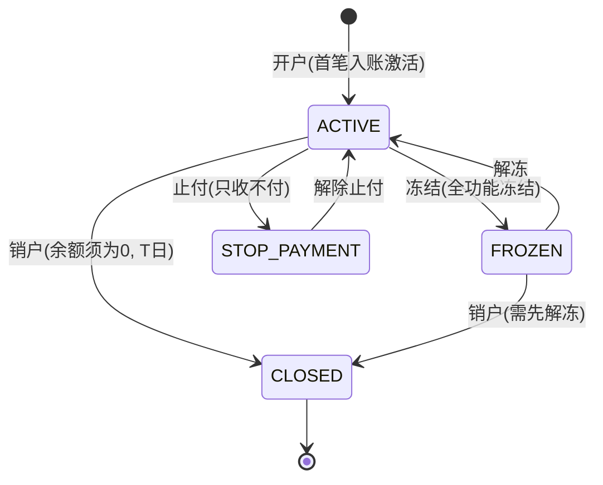
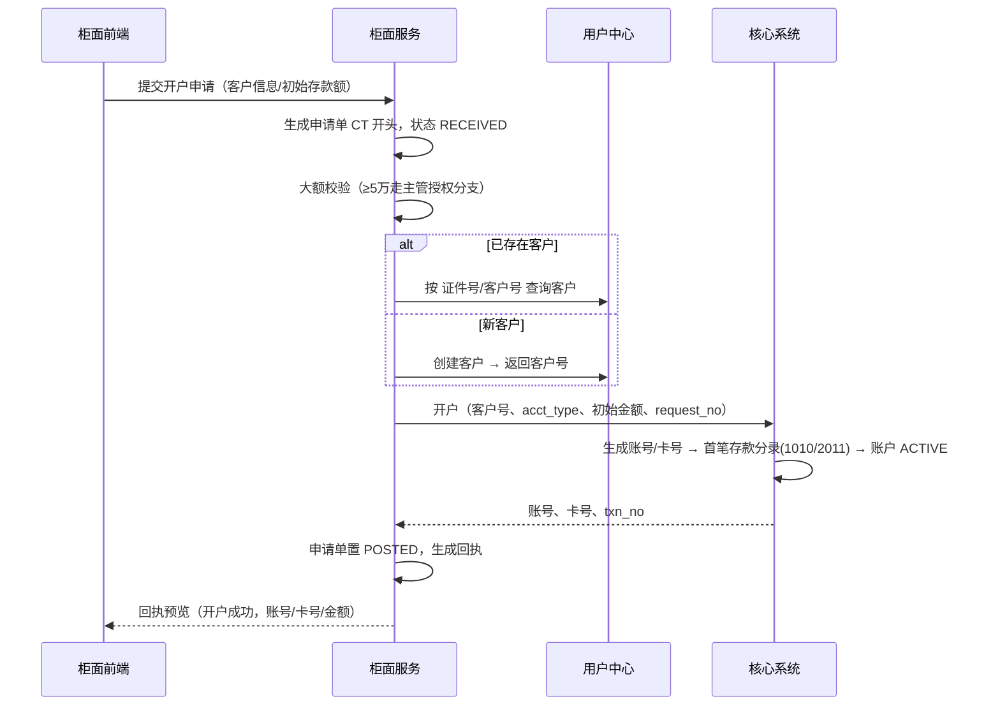
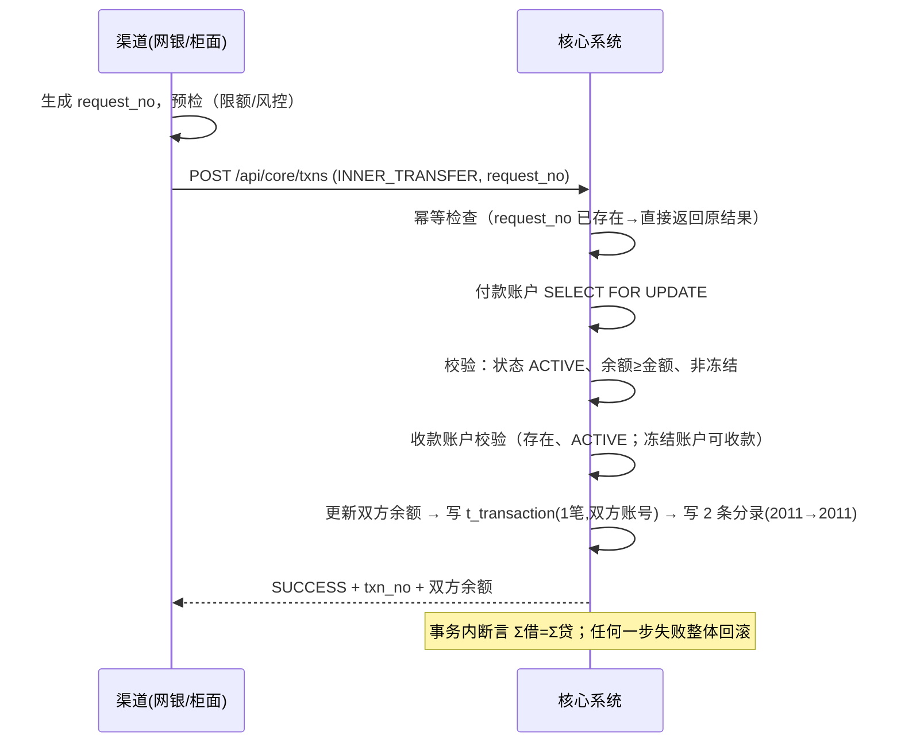
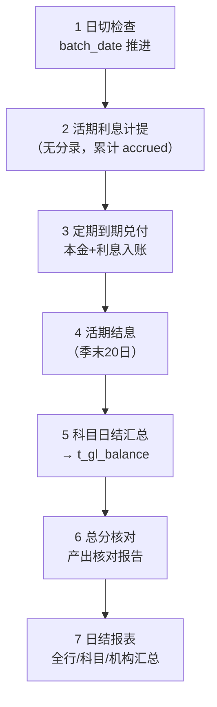

# 03 · 核心系统业务设计（airbank-core）

> 核心系统是全行账务的**唯一权威账本**：所有资金变动必须以核心复式分录为准。

## 1. 客户与账户模型

- **客户**（Customer）：来自用户中心（UAM）主数据，核心仅保存客户号引用。一个客户可持有多个账户。
- **账户**（Account）：
  - `acct_type`：`DEMAND`（个人活期）/ `TIME`（个人定期，子表存单）。
  - 账户 = 明细账：余额、可用余额、冻结金额、计息累计等。
  - 账户挂**负债类科目**（活期 2011 / 定期 2012），科目余额由分录汇总，与账户余额做**总分校验**。
  - 每个活期账户同时发放一张模拟借记卡（卡号 62 开头，与账号 1:1），用于网银绑定。

### 账户状态机

| 状态 | 入金 | 出金 | 说明 |
|---|---|---|---|
| ACTIVE 正常 | ✅ | ✅ | |
| STOP_PAYMENT 止付 | ✅ | ❌ | 挂失/风控场景 |
| FROZEN 冻结 | ❌ | ❌ | 司法/风控冻结 |
| CLOSED 销户 | ❌ | ❌ | 保留历史流水可查 |

## 2. 会计科目与复式记账引擎

### 2.1 科目表（v1 种子）

| 科目号 | 科目名称 | 类别 | 方向 | 用途 |
|---|---|---|---|---|
| 1010 | 库存现金 | 资产 | 借 | 柜面现金（按机构辅助核算） |
| 2011 | 个人活期存款 | 负债 | 贷 | 活期账户明细账 |
| 2012 | 个人定期存款 | 负债 | 贷 | 定期存单 |
| 2061 | 代理理财资金 | 负债 | 贷 | 理财募集与存续资金池 |
| 6011 | 利息支出-存款利息 | 损益 | 借 | 活期结息、定期付息 |
| 6012 | 利息支出-理财收益 | 损益 | 借 | 理财收益兑付 |
| 6051 | 中间业务收入 | 损益 | 贷 | 手续费收入（预留） |

### 2.2 记账引擎

- **分录（journal entry）** append-only：`journal_id, txn_no, batch_date, entry_no, dr_cr(DR/CR), subject_code, acct_no(可空), amount(分), summary, create_time`。每笔业务至少两条分录，**Σ借 = Σ贷** 由引擎在事务内断言。
- **统一记账接口** `POST /api/core/txns`（服务内部+渠道）：入参业务类型 + 借贷要素 + `request_no`，核心在一个数据库事务内完成：幂等检查 → 余额更新（行锁）→ 写交易流水 → 写分录 → 返回 `txn_no`。
- **分录模板**（由业务类型 `txn_type` 驱动，代码内模板表可扩展）：

| txn_type | 业务 | 借方 | 贷方 |
|---|---|---|---|
| CASH_DEPOSIT | 现金存款 | 1010 库存现金 | 2011 客户活期 |
| CASH_WITHDRAW | 现金取款 | 2011 客户活期 | 1010 库存现金 |
| INNER_TRANSFER | 行内转账 | 2011 付款账户 | 2011 收款账户 |
| DEMAND_TO_TIME | 活期转定期 | 2011 | 2012 |
| TIME_MATURITY | 定期到期兑付（本金） | 2012 | 2011 |
| TIME_INTEREST | 定期付息 | 6011 | 2011 |
| TIME_EARLY_BREAK | 提前支取（本金，按活期计息） | 2012 | 2011 |
| DEMAND_INTEREST | 活期结息 | 6011 | 2011 |
| WEALTH_SUBSCRIBE | 理财申购扣款 | 2011 | 2061 |
| WEALTH_REDEEM | 理财赎回/到期兑付（本金） | 2061 | 2011 |
| WEALTH_INCOME | 理财收益支付 | 6012 | 2011 |
| REVERSAL | 冲正（按原交易逐分录反向生成） | … | … |

### 2.3 交易流水（业务层）

`t_transaction`：每笔业务一行，记录 `txn_no`（核心流水号）、`request_no`（渠道幂等号，**唯一索引**）、`txn_type`、金额、对手账户、渠道（COUNTER/EBANK/BATCH）、柜员工号/操作员、状态（SUCCESS/FAILED/REVERSED）、会计日期。查询与对账均以此为准。

## 3. 编号规则（全行统一）

| 对象 | 规则 | 示例 |
|---|---|---|
| 客户号 | `10` + 10 位序号（UAM 签发） | `100000000123` |
| 账号 | 3 位机构 + 4 位产品码 + 10 位序号 + 1 位 Luhn 校验，共 18 位 | `990000100000000123`? 见注 |
| 卡号 | `62` + 16 位数字 + Luhn，共 19 位 | `6200000000001234567` |
| 定期存单号 | `TD` + yyyyMMdd + 8 位序列 | `TD2026091000000012` |
| 核心流水号 txn_no | `TX` + yyyyMMddHHmmss + 6 位序列 + 3 位随机 | `TX20260910213000000123abc` |
| 幂等号 request_no | 渠道生成：渠道码 + 终端号 + UUID（32 位以内） | `CTR-990001-0f8f6e…` |
| 理财订单号 | `WO` + yyyyMMdd + 10 位序列 | `WO202609100000000042` |
| 柜面申请单号 | `CT` + yyyyMMdd + 8 位序列 | `CT2026091000000087` |
| 回执号 | `VCH` + 12 位随机大写 | `VCH7K2M9XQ1P3RT` |

> 注：账号产品码 `0001`=活期、`0002`=定期；序号部分由数据库序列保证，Luhn 校验位便于前端即时校验录入错误。

## 4. 业务流程

### 4.1 开户（柜面）

规则：开户必须附带初始现金存款（≥ ¥1.00，建议引导 ¥100.00）；初始存款计入柜员尾箱收入。

### 4.2 现金存款 / 取款（柜面）

- 前置：柜员已签到，尾箱余额充足（取款时）；单笔 ≥ ¥50,000 触发**主管授权**（复核通过后才调核心）。
- 核心：幂等（request_no）→ 账户状态检查（冻结拒绝出金）→ 余额校验 → 更新余额 + 写流水 + 分录。
- 柜面：同步更新尾箱（存款 +，取款 −），写 `t_cash_box_flow`；回执生成。

### 4.3 行内转账

规则：
- 同客户同人转账不限制；转账备注 ≤ 50 字，落流水摘要。
- 手续费 v1 = 0（6051 预留），避免首版复杂化。
- **幂等语义**：同 `request_no` 重复提交，返回首次处理结果（HTTP 200，响应标记 `duplicated=true`），绝不二次扣账。
- 收付双方必须为不同账号；收款账户为定期存单号时拒绝（仅活期可收）。

### 4.4 定期存款（整存整取）

| 档期 | 利率（种子，Nacos 可调） | 起存 |
|---|---|---|
| 3 个月 | 1.15% | ¥1,000 |
| 6 个月 | 1.35% | ¥1,000 |
| 1 年 | 1.55% | ¥1,000 |
| 2 年 | 1.85% | ¥1,000 |
| 3 年 | 2.20% | ¥1,000 |

- 存入：活期 → 定期（分录 2011→2012），生成存单号，记 `value_date` 起息日与 `maturity_date` 到期日。
- 到期兑付：日终批量扫描到期存单 → 本金（2012→2011）+ 利息（6011→2011，按约定利率 360 天基）→ 存单状态 `MATURED_PAID`。
- **提前支取**：全额支取，利息按**活期利率**按实际天数计算；存单状态 `BROKEN_EARLY`。
- 到期未兑付期间（批量日与到期日之间的自然延迟）按活期利率计息（简化：到期日即兑付）。

### 4.5 冻结 / 解冻 / 止付

柜面操作，核心只做状态迁移 + 留痕（`t_transaction` 类型 `ACCT_FREEZE/UNFREEZE`，金额 0，不影响分录平衡）。冻结金额 v1 = 全额冻结（部分冻结为 P2）。

## 5. 利息设计

| 项 | 规则 |
|---|---|
| 计息基础 | 年利率 / 360，按实际天数；单利 |
| 活期计提 | 日终批量逐户：`当日计提 = 日终余额 × 活期利率 ÷ 360`，累加到 `accrued_interest`（只计提，不记账） |
| 活期结息 | 每季末 20 日（`batch_date` 判断）批量入账：分录 6011→2011，清零计提累计；也可管理端手动触发 |
| 定期利息 | 到期一次性：`本金 × 利率 × 期限天数 ÷ 360`；提前支取改按活期利率 × 实际天数 |
| 利率参数 | Nacos `airbank-biz-params.yaml`，计提时取当日生效利率快照入账，改利率只影响未来 |
| 利息税 | 模拟环境不计 |

## 6. 余额与并发控制

- 账户表含 `balance`（余额）、`frozen_amount`、`available = balance - frozen_amount`、`version`（乐观锁备用）。
- 所有余额变动在事务内对账户行 `SELECT … FOR UPDATE`，保证同账户串行；跨账户（转账）按**账号升序**加锁防死锁。
- 每笔分录记录 `balance_after`（该账户交易后余额），支持"账户明细余额追溯"（回单/差错排查）。

## 7. 对账与核对

| 核对项 | 时点 | 规则 |
|---|---|---|
| 分录平衡 | 每笔记账事务内 | Σ借 = Σ贷，否则回滚抛 `ACCOUNTING_UNBALANCED` |
| 总分核对 | 日终批量 | Σ账户余额（2011/2012/2061 明细合计）= 科目日结余额；不一致生成差错报告（不自动调账） |
| 尾箱核对 | 柜员日结 | 尾箱余额 = 当日现金类分录按机构+柜员的净额 |
| 理财对账 | 日终批量后 | 2061 科目余额 = 理财存续持仓本金合计（理财服务核对，见 04 §7） |

## 8. 日终批量设计

自研轻量批量框架（ADR-2）：`t_batch_task`（任务实例：类型/会计日期/状态/步骤游标）+ `t_batch_step_log`（步骤日志：行数、耗时、失败原因）。

- 触发：定时（cron 可配，默认 23:30）或管理接口手动触发（**培训可随时手动日终**）。
- 分布式锁（Redis）防并发触发；每个步骤幂等：同 `batch_date` 重跑先回冲该步骤已入账数据或跳过已处理键（定期兑付按存单状态天然幂等）。
- 批量入账统一标记 `channel=BATCH`，使用批次级 `request_no` 保证可重跑。
- 批量期间不阻断联机交易（简化，文档明示与真实银行的批量墙差异）。

## 9. 核心对外接口概览

完整定义见 07 号文档。按域分组：

| 域 | 接口（示例） |
|---|---|
| 账户 | 开户 / 销户 / 冻结 / 解冻 / 账户详情 / 按客户查账户列表 / 卡号查账号 |
| 交易 | 统一记账（幂等）/ 交易流水号查询 / 冲正 / 按账户查明细（分页）/ 按客户查流水 |
| 定期 | 存入 / 存单详情 / 提前支取 / 按客户查存单 |
| 利息 | 账户计提余额查询 / 利率参数查询 |
| 批量 | 触发日终 / 批量任务状态 / 总分核对报告 / 手动结息 |
| 报表 | 科目日结表 / 全行日结单 / 交易量统计 |

## 10. 异常与错误码（核心段 3000~3999）

| 码 | 含义 | 触发 |
|---|---|---|
| 3001 | 账户不存在 | 账号/卡号查无 |
| 3002 | 余额不足 | 出金 > 可用 |
| 3003 | 账户状态不允许该交易 | 冻结出金、销户交易 |
| 3004 | 幂等冲突（同号不同内容） | request_no 撞号但报文不一致 |
| 3005 | 账户已销户 | |
| 3006 | 收款账户不可收 | 定期/冻结入金限制 |
| 3007 | 金额非法 | ≤0 / 超单笔上限 / 非整数分 |
| 3008 | 存单状态不允许支取 | 已兑付/已提前支取 |
| 3009 | 会计分录不平衡（系统级） | 引擎断言失败，500 |
| 3010 | 定期起存金额不足 | |
| 3011 | 批量任务正在执行 | 重复触发日终 |
