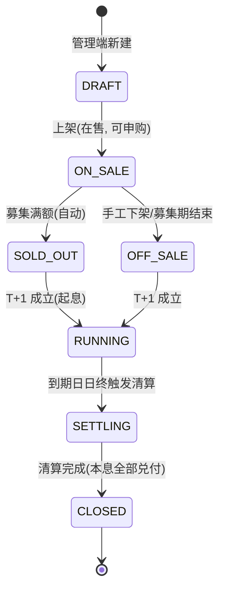
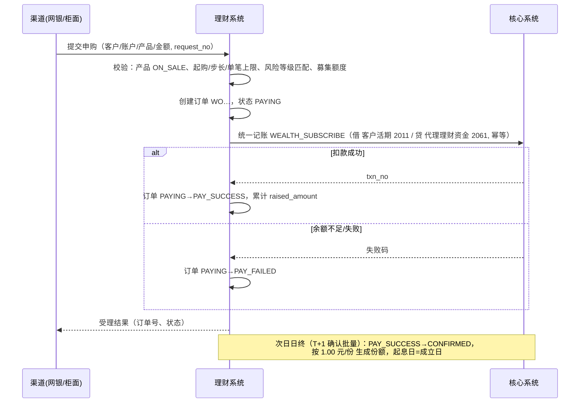
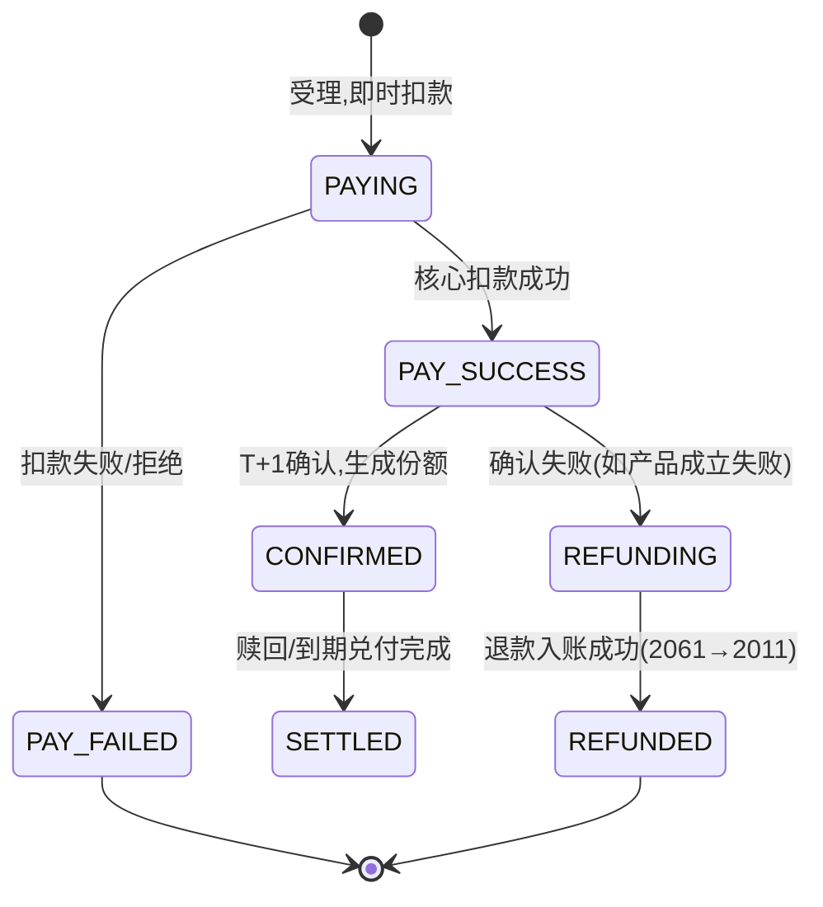
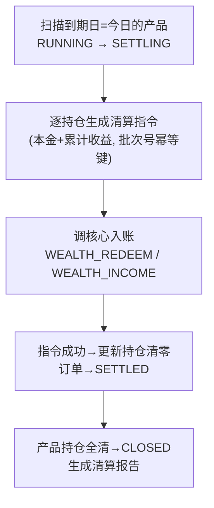

# 04 · 理财系统业务设计（airbank-wealth）

> 理财系统管理产品与份额，**资金变动一律通过核心系统记账接口完成**（幂等）。
> v1 采用"预期收益率型"封闭式产品，净值型为二期（ADR 见 02 §8）。

## 1. 产品模型

| 属性 | 说明 |
|---|---|
| product_code | 产品编码，如 `WB001` |
| product_name | 名称，如"稳盈90天90期" |
| term_days | 期限（天），决定到期日 |
| annual_rate | 业绩比较基准（年化，存 DECIMAL(6,4)，如 0.0260） |
| risk_level | R1/R2/R3（对应客户测评 C1~C5 准入：产品 Rn 需客户 Cn 及以上） |
| min_amount / step_amount | 起购金额 / 追加步长（分），如 1,000 元起、1,000 元递增 |
| max_single_amount | 单笔上限 |
| raise_limit | 募集上限（分），售罄拒单 |
| raised_amount | 已募集（申购扣款成功累计） |
| value_date / maturity_date | 成立日（起息）/ 到期日 |
| status | 产品状态机，见下 |

### 产品状态机

| 状态 | 申购 | 赎回 | 收益计提 |
|---|---|---|---|
| ON_SALE 在售 | ✅（即时扣款） | ❌ | ❌（未起息） |
| SOLD_OUT / OFF_SALE（待成立） | ❌ | ❌ | ❌ |
| RUNNING 存续 | ❌ | ✅（T+1 确认） | ✅ 每日 |
| SETTLING 清算中 | ❌ | ❌ | 最后一日并入清算 |
| CLOSED 已结 | ❌ | ❌ | ❌ |

## 2. 申购流程（渠道：网银 / 柜面）

规则：
- **资金前置**：下单即扣款（冻结资金进 2061），杜绝 T+1 确认时余额不足问题；确认失败自动退款（见 §5）。
- 风险匹配：客户风险等级 Cx（UAM 测评）< 产品 Rn 时拒绝（`4003`），前端置灰提示。
- 募集额度：Redis `DECR` 预扣 + DB 校验兜底，售罄自动置 `SOLD_OUT`。
- 幂等：`request_no` 全链路传递（渠道→理财→核心），任何一层重放不重复扣款。

## 3. 赎回流程

- 存续期（RUNNING）可全额/部分赎回（部分赎回后份额不得低于起购，否则转全额）。
- 受理：校验持仓份额充足 → 创建赎回订单 `REDEEMING` → **当日锁份额**（position.available_shares 扣减）。
- T+1 确认批量：计算应付本金（份额 × 1.00）+ 已计提未付收益 → 生成两条入账指令：
  - 本金：`WEALTH_REDEEM`（2061 → 2011）
  - 收益：`WEALTH_INCOME`（6012 → 2011）
- 入账成功 → 订单 `SETTLED`，持仓份额扣减，收益记录核销；入账失败 → 订单保持 `REDEEMING`，批量重跑（幂等）。
- 持有 < 7 天赎回费率字段预留（v1 = 0）。

## 4. 份额与收益

- 份额模型：**1.00 元 = 1.00 份**（简化确认），份额 DECIMAL(20,2)。
- 持仓表 `t_position`：客户 × 产品，`total_shares / frozen_shares(赎回在途) / cost_amount / paid_income(已付收益) / accruing_income(计提中收益)`。
- 每日计提（日终批量 23:40，仅 RUNNING 产品）：
  - 每持仓每日收益 = `cost_amount × annual_rate ÷ 360`（分，四舍五入）；
  - 写 `t_income_record`（按持仓按日唯一），累加 `accruing_income`；
  - 只计提不付账，付账发生在**赎回/到期清算**（避免每日万级小额分录，同时演示"计提 vs 实付"两种会计处理）。
- 客户展示口径：持仓金额 = cost + accruing（昨日含）。

## 5. 订单状态机与补偿

补偿矩阵：

| 故障点 | 现象 | 处理 |
|---|---|---|
| 核心扣款超时（理财侧未知结果） | 订单停在 PAYING | 渠道/批量按 request_no 反查核心：已成功→推进 PAY_SUCCESS；未成功→PAY_FAILED。核心幂等保证反查+重放安全 |
| 扣款成功但确认批量失败 | PAY_SUCCESS 滞留 | 确认批量幂等重跑 |
| 确认阶段产品异常需退款 | REFUNDING | 自动生成退款指令（反向分录），幂等入账后 REFUNDED |
| 清算指令入账失败 | SETTLING 滞留 | 清算批量重跑（指令表幂等） |

> 该补偿链路本身就是"分布式一致性"教学素材：11 号文档场景 S12 专门演练"kill 理财服务后恢复对账"。

## 6. 到期清算（日终批量）

- 清算指令落 `t_settlement_instruction`（batch_no + position 唯一），可断点重跑。
- 清算完成后生成 `t_settlement_report`：产品维度 本金/收益/笔数 汇总，供柜面/网银展示与培训讲解。
- 到期当日产品仍可展示"清算中"，客户资金 T+1 晨间到账（批量时间可手动触发提前演示）。

## 7. 理财与核心对账

- **日终**（核心总分核对之后）：理财拉取核心 `2061` 科目余额与当日分录明细；
- 比对：`2061 余额 == Σ(持仓 cost_amount)`、按 `request_no/txn_no` 双边流水勾兑；
- 差异落 `t_recon_diff`（理财库），管理端展示；v1 不自动调账，出报告供培训分析。

## 8. 理财系统接口概览

| 域 | 接口（示例） |
|---|---|
| 产品 | 产品列表（分页/筛选）/ 详情 / 上架 / 下架 / 新建（管理） |
| 申购 | 提交申购 / 订单状态查询 / 按客户查订单 |
| 赎回 | 提交赎回 / 赎回记录 |
| 持仓 | 按客户查持仓 / 持仓收益明细（按日） |
| 批量 | 触发确认/计提/清算 / 清算报告查询 |
| 对账 | 对账差异查询 |

## 9. 错误码（理财段 4000~4999）

| 码 | 含义 |
|---|---|
| 4001 | 产品不存在 / 已结 |
| 4002 | 产品不在售（状态不允许申购） |
| 4003 | 客户风险等级不匹配 |
| 4004 | 低于起购金额 / 不满足步长 |
| 4005 | 超单笔上限 |
| 4006 | 募集额度不足（售罄） |
| 4007 | 持仓份额不足（赎回超额） |
| 4008 | 产品非存续期，不可赎回 |
| 4009 | 扣款失败（核心返回码透传，如余额不足） |
| 4010 | 订单状态不允许该操作 |
| 4011 | 低于最低留存份额（转全额赎回提示） |
