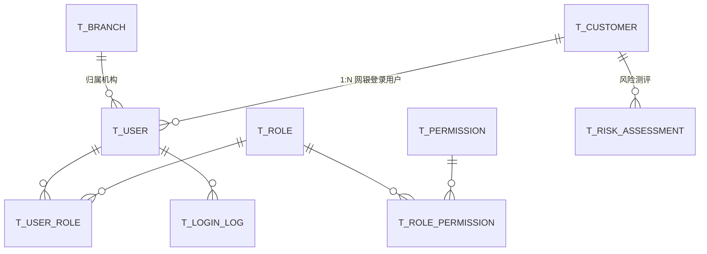
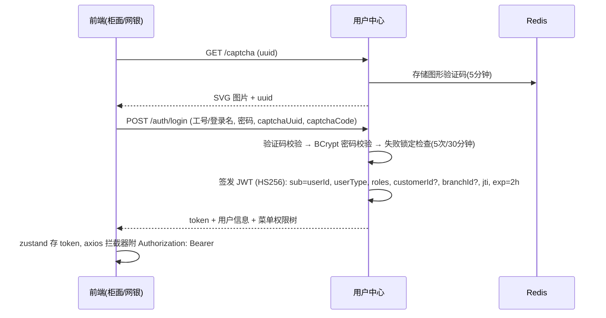
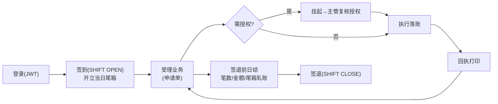
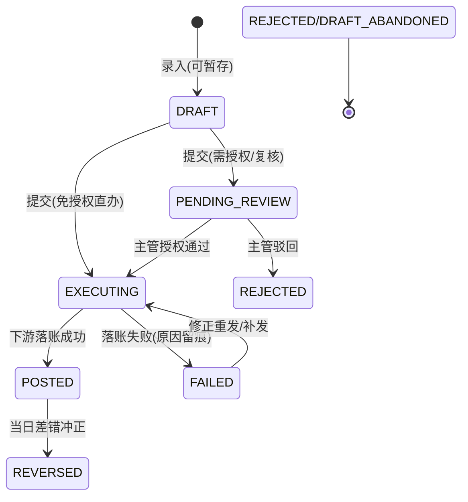
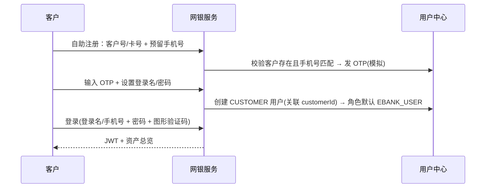
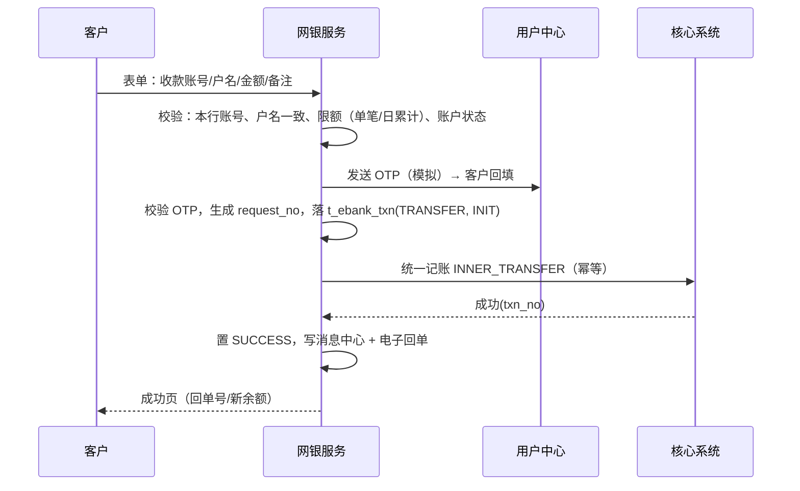
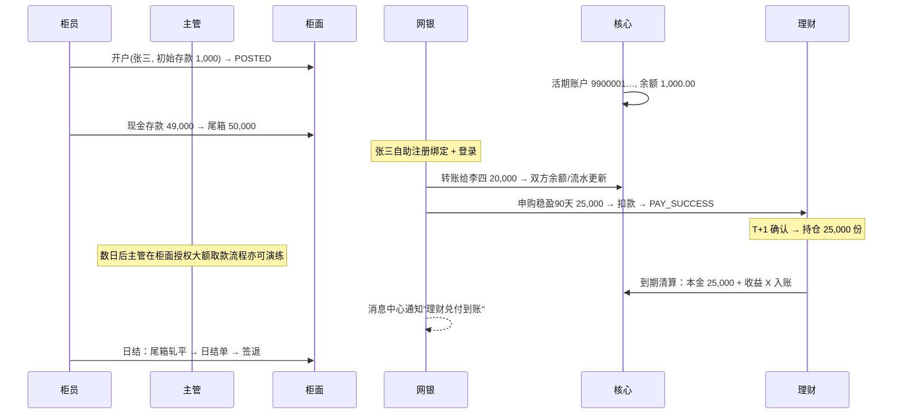

# 05 · 用户中心与渠道设计（uam / counter / ebank）

> 用户中心提供身份、认证与权限基座；柜面与网银两个渠道基于它完成端到端业务。

## 1. 用户中心（airbank-uam）

### 1.1 领域模型

- **客户（customer）**：银行档案主体（姓名、证件类型/号码、手机号、职业等敏感字段加密存储）。客户号 `10` 开头 12 位。
- **用户（user）**：登录主体，`user_type = TELLER（柜面）/ CUSTOMER（网银）/ ADMIN`。柜员用户挂机构与工号；网银用户必须关联 customer_id（一个客户可有唯一网银登录名）。
- **权限（permission）**：`menu`（前端菜单可见性）与 `action`（后端操作点）两类，编码如 `counter:account-open`、`review:authorize`。
- **角色（role）**：种子角色 —— `TELLER`（柜员）、`SUPERVISOR`（主管：授权+复核+日终审核）、`ADMIN`（系统管理员：机构/柜员/产品/参数/造数）。
- **风险测评（risk_assessment）**：5 题（收入稳定性/投资经验/亏损承受…加权打分）→ C1 保守 ~ C5 激进，有效期 1 年，理财准入依据。

### 1.2 认证设计

- **JWT Claims**：`userId, loginName, userType, roles[], branchId(柜员), customerId(网银), jti, iat, exp(2h)`。签名密钥与过期时间在 Nacos `airbank-security.yaml`。
- 校验：网关全局过滤器校验签名与过期（白名单放行 login/captcha/swagger）；下游服务解析同一 JWT 做细粒度 `@PreAuthorize` 式权限（自定义注解 `@RequirePerm("counter:account-open")`）。
- **网银 OTP（短信模拟）**：转账/调额/重置密码等敏感操作需 OTP：`POST /otp/send` 生成 6 位码存 Redis（5 分钟）+ 写入消息中心；前端提供醒目的"查看验证码"入口（培训环境特性，ADR-8）。
- 登出：JWT 无状态，前端删除 token + Redis 黑名单 `jti`（网关校验），简单有效。

### 1.3 RBAC 与菜单

- 柜面前端菜单由 `/api/uam/auth/menus` 按角色动态返回；网银功能全体客户可见（无菜单级权限，仅登录态）。
- 操作点权限双保险：菜单隐藏（体验）+ 后端注解校验（安全）。

## 2. 柜面系统（airbank-counter）

### 2.1 柜员工作日模型

- **签到**：生成 `t_teller_shift`（当日唯一），初始化/接续尾箱 `t_cash_box`（上日结转）。
- **尾箱**：现金存款 +、取款 −、开户初始存款 +；尾箱上限（默认 ¥200,000，Nacos 可配）超限拒绝取款并提示上缴。
- **日结**：汇总当日申请单（笔数/借贷金额）、核对 `尾箱余额 == Σ现金类流水净额 + 上日结转`，生成 `t_day_settlement` 日结单（前端可打印），全部平账方可签退（管理员可强制签退留痕）。

### 2.2 业务申请单（统一受理模型）

柜面所有业务走统一"申请单"：`t_counter_txn（单号 CT…、biz_type、业务报文 JSONB、状态、受理柜员、复核柜员）`：

- **授权矩阵**（Nacos 可配）：

| 业务 | 免授权阈值 | 需主管授权 |
|---|---|---|
| 现金存/取 | < ¥50,000 | ≥ ¥50,000 |
| 转账 | < ¥50,000 | ≥ ¥500,000 双人复核语义（v1 仍由主管） |
| 开户/销户/冻结 | 均需 | 销户/冻结一律复核 |
| 理财申赎 | 同转账金额线 | — |

- **复核授权**：主管在同一工作台"待复核队列"查看申请单报文明细（双人复核：主管可看到受理柜员、金额、账户），通过后由**系统自动执行**（申请单不等回柜员手中重放，防"先斩后奏"）。授权操作写独立审计。
- **回执**：每笔 POSTED 业务生成 `t_voucher`（结构化回执数据 → 前端渲染 PDF 预览/打印，含行章标识"AirBank 培训环境专用"）。

### 2.3 柜面功能清单

| 菜单 | 功能 | 说明 |
|---|---|---|
| 工作台 | 今日业务统计、尾箱余额、待复核数、快捷入口 | 签到后首页 |
| 业务办理 | 开户 / 现金存款 / 现金取款 / 转账 / 定期存入 / 定期支取 / 理财申购 / 理财赎回 / 销户 / 冻结·解冻 | 统一表单风格：查户 → 录入 → 提交 → 回执 |
| 待复核授权 | 队列 + 报文明细 + 通过/驳回 | 主管角色 |
| 客户查询 | 按证件/客户号/手机号查客户与名下账户 | |
| 当日冲正 | 选择本人当日 POSTED 单据反向冲正 | 需授权 |
| 日结签退 | 日结单 + 轧账 + 签退 | |
| 回执管理 | 当日/历史回执查询打印 | |
| 系统管理（admin/主管） | 机构、柜员、角色、产品上架、参数查看、批量触发、造数 | |

## 3. 网上银行（airbank-ebank）

### 3.1 注册与登录

- 仅已开户客户可注册（真实银行同语义）；一个客户仅一个网银账号。
- 密码策略：8~20 位，须含字母+数字（BCrypt 存储）；连续 5 次失败锁定 30 分钟。

### 3.2 转账（含限额）

- **限额**（Nacos `airbank-biz-params.yaml`，客户可下调、上调需 OTP）：

| 渠道 | 单笔 | 日累计 |
|---|---|---|
| 网银 | ¥50,000 | ¥200,000 |
| 柜面 | 尾箱/授权约束 | — |

- 收款人名册（P0）：常用收款人增删，姓名+账号校验。
- 日累计口径：当日 SUCCESS 的 EBANK 渠道转账合计，跨渠道不共享。

### 3.3 理财超市

- 产品卡片列表（在售：名称/代码/期限/业绩基准/风险标签/起购），筛选排序。
- 购买流程：输入金额 → 风险匹配校验 → 协议勾选（模拟协议文本）→ OTP → 下单（走 §2 申购链路）→ 结果页。
- 我的持仓：本金、累计收益（昨日收益/持有收益）、状态；支持赎回（金额/份额二选一展示）。
- 交易记录：申赎订单全生命周期可查。

### 3.4 查询与单据

| 功能 | 说明 |
|---|---|
| 资产总览 | 存款余额 + 理财持仓市值卡片、近 10 笔交易、收益周报（P1） |
| 账户明细 | 核心流水分页查询，按类型/日期/金额筛选，CSV 导出 |
| 定期存单列表 | 到期日、利率、状态 |
| 电子回单 | 转账/申赎回单，防伪编号，PDF 下载 |
| 消息中心 | OTP（已读脱敏）、交易通知、批量到期兑付通知 |
| 安全设置 | 改密、限额调整、登录设备（P2） |

## 4. 端到端示例：柜面开户 → 网银全流程

## 5. 错误码补充（渠道段）

### 柜面 5000~5999

| 码 | 含义 |
|---|---|
| 5001 | 柜员未签到 / 已签退 |
| 5002 | 尾箱余额不足（取款） |
| 5003 | 尾箱超限（存款） |
| 5004 | 该单据当前状态不允许此操作 |
| 5005 | 无授权权限（非主管复核） |
| 5006 | 自复核禁止（受理人≠复核人） |
| 5007 | 日结未通过，不允许签退 |
| 5008 | 冲正仅限当日本人交易 |

### 网银 6000~6999

| 码 | 含义 |
|---|---|
| 6001 | 未绑定/注册信息不匹配 |
| 6002 | OTP 错误或过期 |
| 6003 | 超出单笔限额 |
| 6004 | 超出当日累计限额 |
| 6005 | 收款户名与账号不符 |
| 6006 | 仅支持本行账户 |
| 6007 | 登录锁定中（稍后再试） |
| 6008 | 非本人账户操作 |

### 用户中心 2000~2999

| 码 | 含义 |
|---|---|
| 2001 | 客户不存在 |
| 2002 | 证件号已开户（客户重复建立） |
| 2003 | 登录名已存在 |
| 2004 | 用户名或密码错误 |
| 2005 | 验证码错误/过期 |
| 2006 | 登录失败次数过多，锁定 |
| 2007 | 无操作权限 |
| 2008 | 风险测评缺失/已过期 |
| 2009 | 手机号与预留不符 |
