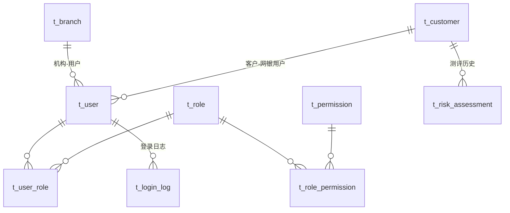
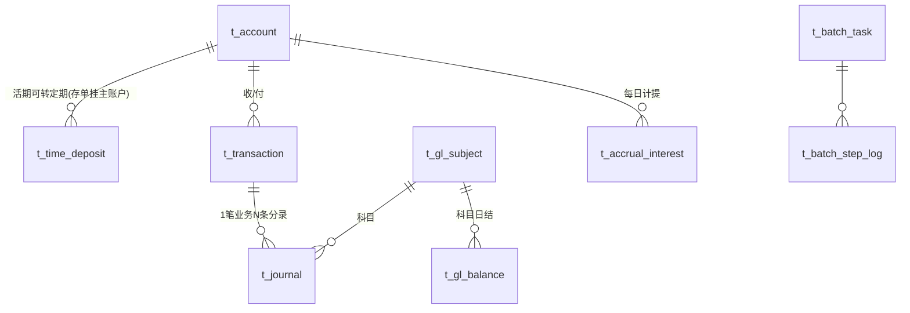
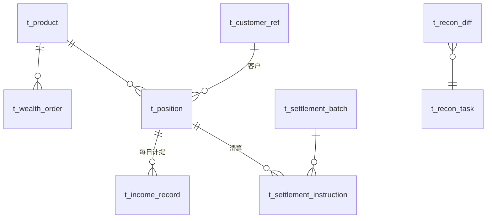

# 06 · 数据模型设计

> Database-per-Service：单 PostgreSQL 16 实例、5 个独立 database（ADR-7）。跨库禁止直查（PG 权限层隔离），跨域只走 API。
> 通用约定：金额 `BIGINT`（分）；主键 `BIGSERIAL`；所有表含审计字段 `created_at / updated_at / created_by / updated_by`（下表省略）；字符集 UTF8，时区 Asia/Shanghai；索引命名 `uk_` 唯一 / `idx_` 普通。

## 1. 库规划

| database | 归属服务 | 定位 |
|---|---|---|
| `airbank_uam` | airbank-uam | 客户、用户、权限、机构、测评 |
| `airbank_core` | airbank-core | 账户、流水、分录、科目、批量 |
| `airbank_wealth` | airbank-wealth | 产品、订单、持仓、收益、清算、对账 |
| `airbank_counter` | airbank-counter | 签到、尾箱、申请单、复核、回执、日结 |
| `airbank_ebank` | airbank-ebank | 网银流水引用、限额、回单、消息、名册 |

## 2. airbank_uam（用户中心）

### t_customer 客户

| 字段 | 类型 | 约束/索引 | 说明 |
|---|---|---|---|
| id | BIGSERIAL | PK | |
| customer_no | VARCHAR(12) | UK | `10` 开头 |
| customer_name | VARCHAR(64) | idx | 姓名 |
| id_type | VARCHAR(2) | | 证件类型 01 身份证 |
| id_no_enc | VARCHAR(256) | UK | 证件号 AES-GCM 密文；另存 `id_no_mask` VARCHAR(18) 脱敏展示 |
| mobile_enc | VARCHAR(256) | | 手机号密文 + `mobile_mask` |
| gender / birthday / occupation / address | | | 基础画像 |
| risk_level | CHAR(2) | | 最新测评等级 C1~C5（冗余） |
| risk_assess_date | DATE | | |
| status | VARCHAR(16) | | NORMAL / CLOSED |

### t_user 用户（登录主体）

| 字段 | 类型 | 说明 |
|---|---|---|
| id / user_type VARCHAR(16) / login_name VARCHAR(32) UK | | TELLER/CUSTOMER/ADMIN |
| password_hash | VARCHAR(72) | BCrypt |
| customer_id BIGINT FK NULL | | 网银用户必填 |
| teller_no VARCHAR(8) UK NULL / branch_id BIGINT FK NULL | | 柜员必填，工号=机构3位+序号3位 |
| real_name VARCHAR(64) / mobile_mask | | 展示用 |
| status / fail_count / lock_until | | NORMAL/LOCKED；登录失败锁定 |

### t_role / t_permission / t_user_role / t_role_permission

标准 RBAC 五表（角色含 role_code UK：TELLER/SUPERVISOR/ADMIN/EBANK_USER；permission 含 perm_type MENU/ACTION、perm_code UK、名称、父级菜单 parent_id、排序 sort）。

### t_branch 机构

`branch_no VARCHAR(3) UK`（990 总行营业部/991/992）、`branch_name`、`address`、`status`。

### t_risk_assessment 风险测评

`customer_id FK`、`score INT`、`level CHAR(2)`、`answers JSONB`、`assess_date`、`expire_date`。

### t_login_log 登录日志

`user_id`、`channel(COUNTER/EBANK)`、`ip`、`user_agent`、`result(SUCCESS/FAIL)`、`reason`、`login_time`。索引 `(user_id, login_time)`。

## 3. airbank_core（核心系统）

### t_account 账户

| 字段 | 类型 | 约束/索引 | 说明 |
|---|---|---|---|
| id | BIGSERIAL | PK | |
| acct_no | VARCHAR(18) | UK | 18 位账号 |
| card_no | VARCHAR(19) | UK | 62 开头 |
| customer_id | BIGINT | idx | UAM 客户主键 |
| acct_type | VARCHAR(8) | | DEMAND / TIME |
| product_code | VARCHAR(4) | | 0001 活期 / 0002 定期 |
| subject_code | VARCHAR(8) | | 2011 / 2012 |
| branch_no | VARCHAR(3) | idx | 开户机构 |
| balance | BIGINT | CHECK >= 0 | 余额（分） |
| frozen_amount | BIGINT | | 冻结金额 |
| accrued_interest | BIGINT | | 活期计提累计（未结息） |
| last_interest_date | DATE | | 上次结息日 |
| status | VARCHAR(16) | idx | ACTIVE/FROZEN/STOP_PAYMENT/CLOSED |
| opened_at / closed_at | TIMESTAMP | | |
| version | INT | | 乐观锁备用 |

> 定期账户余额恒为 0，本金在 `t_time_deposit`；活期账户为转账/理财收付款主体。定期销户时同步关主账户（若仅一张存单）。

### t_time_deposit 定期存单

`deposit_no VARCHAR(20) UK`、`acct_no FK`（关联活期主账户，兑付入账）、`term_months INT`、`annual_rate DECIMAL(6,4)`、`amount BIGINT`、`value_date DATE`、`maturity_date DATE`（idx）、`interest BIGINT`（到期应付利息，存入时算定）、`status`（HOLDING/MATURED_PAID/BROKEN_EARLY）、`paid_at`。

### t_transaction 交易流水（业务层）

| 字段 | 类型 | 约束/索引 | 说明 |
|---|---|---|---|
| id | BIGSERIAL | PK | |
| txn_no | VARCHAR(26) | UK | 核心流水号 |
| request_no | VARCHAR(48) | **UK** | 渠道幂等号 |
| txn_type | VARCHAR(24) | idx | §2.2 模板表 |
| amount | BIGINT | >0 | |
| from_acct / to_acct | VARCHAR(18) | idx | 可空（现金类单边） |
| from_balance_after / to_balance_after | BIGINT | | 交易后余额追溯 |
| channel | VARCHAR(8) | idx | COUNTER/EBANK/BATCH/UAM |
| operator | VARCHAR(32) | | 柜员工号/客户登录名 |
| branch_no | VARCHAR(3) | | |
| summary | VARCHAR(128) | | 摘要/备注 |
| batch_date | DATE | idx | 会计日期 |
| status | VARCHAR(12) | | SUCCESS/FAILED/REVERSED |
| reverse_of | VARCHAR(26) | | 冲正原 txn_no |
| finished_at | TIMESTAMP | | |

### t_journal 会计分录（append-only）

`id PK`、`txn_no idx`、`batch_date idx`、`entry_no SMALLINT`、`dr_cr CHAR(2)`（DR/CR）、`subject_code idx`、`acct_no NULL idx`、`amount BIGINT`、`balance_after BIGINT NULL`、`summary`。断言层保证每 `txn_no` Σ借=Σ贷。

### t_gl_subject 科目

`subject_code PK VARCHAR(8)`、`subject_name`、`category`（ASSET/LIABILITY/INCOME/EXPENSE）、`direction`（DR/CR）、`status`。

### t_gl_balance 科目日结

`id PK`、`batch_date`、`subject_code`、`dr_sum BIGINT`、`cr_sum BIGINT`、`balance BIGINT`（方向化余额）；UK `(batch_date, subject_code)`。

### t_accrual_interest 活期每日计提

`id PK`、`acct_no`、`batch_date`、`accrual BIGINT`（当日计提额）、`rate DECIMAL(6,4)`；UK `(acct_no, batch_date)`（幂等重跑键）。

### t_batch_task / t_batch_step_log 批量

task：`batch_type（DAY_END/ACCRUAL/CLEAR...）、batch_date、status(PENDING/RUNNING/SUCCESS/FAILED)、current_step、started_at/finished_at`；UK `(batch_type, batch_date)`。
step_log：`task_id FK、step_no、step_name、rows INT、status、message、cost_ms`。

## 4. airbank_wealth（理财系统）

### t_product 产品

| 字段 | 类型 | 说明 |
|---|---|---|
| id PK / product_code UK VARCHAR(8) / product_name | | |
| term_days INT / annual_rate DECIMAL(6,4) / risk_level CHAR(2) | | R1~R3 |
| min_amount / step_amount / max_single_amount / raise_limit / raised_amount BIGINT | | 分 |
| raise_start_date / raise_end_date / value_date / maturity_date DATE | | 募集与存续 |
| status VARCHAR(12) idx | | DRAFT/ON_SALE/OFF_SALE/SOLD_OUT/RUNNING/SETTLING/CLOSED |
| redeem_fee_rate DECIMAL(6,4) | | 预留 v1=0 |
| created_by / approved_by | | 管理端操作人 |

### t_wealth_order 申赎订单

| 字段 | 类型 | 约束/索引 | 说明 |
|---|---|---|---|
| id PK / order_no VARCHAR(20) UK | | WO+日期+序列 |
| request_no VARCHAR(48) | **UK** | 幂等 |
| order_type VARCHAR(8) | | PURCHASE / REDEEM |
| product_id FK idx / customer_id idx / acct_no | | |
| amount BIGINT | | 申购金额或赎回本金 |
| shares DECIMAL(20,2) | | 确认份额（赎回为扣减份额） |
| income_amount BIGINT | | 赎回支付收益 |
| status VARCHAR(16) idx | | PAYING/PAY_SUCCESS/PAY_FAILED/CONFIRMED/REDEEMING/SETTLED/REFUNDING/REFUNDED |
| pay_txn_no / redeem_txn_no / income_txn_no | | 核心流水号引用 |
| confirm_date DATE | | T+1 确认会计日期 |
| channel VARCHAR(8) / operator | | |
| fail_reason VARCHAR(256) | | |

### t_position 持仓

`customer_id + product_id UK`、`acct_no`、`total_shares DECIMAL(20,2)`、`frozen_shares`（赎回在途）、`cost_amount BIGINT`、`accruing_income BIGINT`（计提未付）、`paid_income BIGINT`、`first_buy_date`。

### t_income_record 收益计提（按日）

`position_id FK`、`batch_date`、`income BIGINT`、`rate DECIMAL(6,4)`；UK `(position_id, batch_date)`。

### t_settlement_batch / t_settlement_instruction 清算

batch：`batch_no UK`、`product_id`、`batch_date`、`status(RUNNING/SUCCESS/FAILED)`、本金/收益合计。
instruction：`id`、`batch_no idx`、`position_id`、`instruction_type(PRINCIPAL/INCOME)`、`amount`、`request_no UK`（幂等调核心）、`txn_no`、`status(NEW/DONE/FAILED)`；UK `(batch_no, position_id, instruction_type)`。

### t_recon_task / t_recon_diff 对账

task：`batch_date UK`、`status`、2061 科目余额、持仓本金合计、差异额。
diff：`task_id FK`、`diff_type(BALANCE/TXN)`、`biz_key`、`core_amount`、`wealth_amount`、`remark`。

## 5. airbank_counter（柜面系统）

### t_teller_shift 签到班次

`id`、`teller_no`、`branch_no`、`shift_date DATE`、`sign_in_at / sign_out_at`、`status(OPEN/CLOSED/FORCED_CLOSED)`；UK `(teller_no, shift_date)`。

### t_cash_box 尾箱

`teller_no + shift_date UK`、`begin_balance BIGINT`（上日结转）、`cash_in / cash_out BIGINT`、`balance BIGINT`。

### t_cash_box_flow 尾箱流水

`id`、`teller_no`、`shift_date`、`direction(IN/OUT)`、`amount`、`biz_type`、`ct_txn_id FK`、`balance_after BIGINT`、`created_at`。

### t_counter_txn 业务申请单

| 字段 | 类型 | 约束/索引 | 说明 |
|---|---|---|---|
| id PK / ct_no VARCHAR(18) UK | | CT+日期+序列 |
| biz_type VARCHAR(24) | idx | ACCOUNT_OPEN / CASH_DEPOSIT / … / ACCOUNT_FREEZE |
| payload JSONB | | 业务报文（金额、账号、客户要素等） |
| amount BIGINT | idx | 金额（便于授权阈值与统计） |
| status | idx | DRAFT/PENDING_REVIEW/REJECTED/EXECUTING/POSTED/FAILED/REVERSED/ABANDONED |
| teller_no / branch_no / shift_date | idx | 受理要素 |
| reviewer_no / reviewed_at / review_comment | | 授权要素 |
| request_no VARCHAR(48) UK | | 下游幂等号（提交时生成） |
| result JSONB | | 下游返回（txn_no、账号、余额） |
| fail_reason | | |
| reversed_by BIGINT | | 冲正关联单 |

### t_voucher 回执

`id`、`ct_txn_id FK`、`voucher_no UK`、`voucher_type`、`content JSONB`（结构化打印数据）、`generated_at`。

### t_day_settlement 柜员日结

`teller_no + shift_date UK`、`txn_count INT`、`cash_in/cash_out/debit_total/credit_total BIGINT`、`box_begin/box_end BIGINT`、`balanced BOOLEAN`、`report JSONB`（日结单渲染数据）、`reviewed_by`。

### t_review_log 授权审计

`id`、`ct_txn_id`、`action(SUBMIT/APPROVE/REJECT)`、`actor`、`comment`、`created_at`。

## 6. airbank_ebank（网上银行）

### t_ebank_txn 网银业务流水（渠道侧留痕）

`id`、`request_no UK`、`biz_type(TRANSFER/SUBSCRIBE/REDEEM)`、`customer_id idx`、`acct_no`、`amount`、`status(INIT/SUCCESS/FAILED)`、`downstream_no`（核心 txn_no / 理财 order_no）、`created_at`、`finished_at`。

### t_transfer_limit 限额

`customer_id UK`、`single_limit BIGINT`、`daily_limit BIGINT`、`updated_by`、`updated_at`（初值来自全局参数，仅可下调，上调需 OTP 留痕）。

### t_beneficiary 收款人名册

`customer_id idx`、`payee_name`、`payee_acct`、`bank_name`（恒"AirBank"）、`alias`；UK `(customer_id, payee_acct)`。

### t_e_receipt 电子回单

`id`、`receipt_no UK`、`customer_id idx`、`biz_type`、`biz_no`（request_no）、`content JSONB`、`created_at`。

### t_message 消息中心

`id`、`customer_id idx`、`msg_type(OTP/TRADE/BATCH)`、`title`、`content`、`is_read BOOLEAN`、`created_at`；OTP 消息默认置为"需验证后查看"，内容对列表接口脱敏。

## 7. Redis Key 设计

| Key 模式 | TTL | 用途 |
|---|---|---|
| `captcha:{uuid}` | 5m | 图形验证码 |
| `otp:{scene}:{target}` | 5m | 短信 OTP（scene: TRANSFER/REGISTER/RESET_PWD/LIMIT） |
| `jwt:blacklist:{jti}` | = 剩余有效期 | 登出黑名单 |
| `idempotent:pre:{request_no}` | 10m | 渠道提交防抖（防连点，DB 唯一索引兜底） |
| `lock:batch:{type}:{date}` | 30m | 批量分布式锁 |
| `wealth:quota:{product_code}` | - | 募集额度预扣计数器 |
| `cache:product:on_sale` | 60s | 在售产品列表缓存 |

## 8. 种子数据清单（deploy/postgres/init 灌入）

| 数据 | 内容 |
|---|---|
| 机构 | 990 总行营业部、991 城东支行、992 城西支行 |
| 角色/权限 | TELLER、SUPERVISOR、ADMIN、EBANK_USER + 菜单/操作点全量 |
| 柜员 | 990001 张柜员(TELLER)、990002 李主管(SUPERVISOR)、999999 admin(ADMIN)，初始密码 `Abc12345` |
| 客户 | 张三/李四/王五（含证件、手机号、测评 C2/C3），网银账号 zhangsan/lisi/wangwu，密码 `Abc12345` |
| 账户 | 每客户 1 活期（余额 50,000.00 / 120,000.00 / 8,000.00），张三另有 1 张 1 年期存单 20,000.00 |
| 科目 | §2.1 全表 |
| 理财产品 | WB001 稳盈90天（R1/2.60%/1千起）、WB002 稳利365（R2/3.05%/1万起）、WB003 进取180（R3/3.80%/1万起），均 ON_SALE |
| 参数 | 活期利率 0.30%、转账限额、授权阈值、尾箱限额（与 Nacos 默认值一致） |
