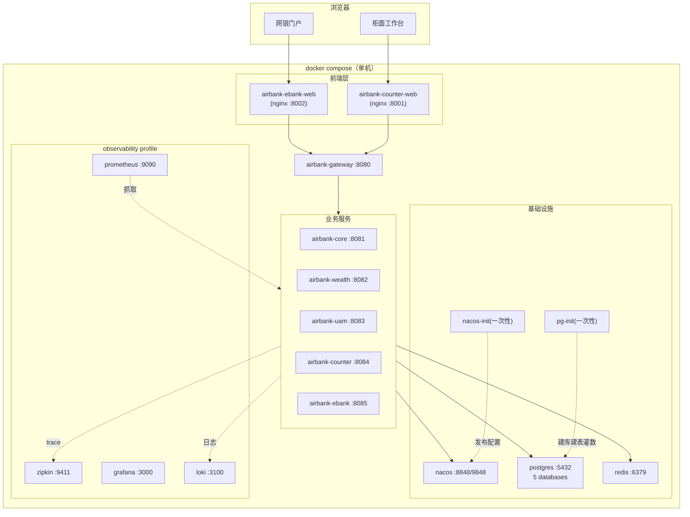

# 09 · 容器化部署设计

> 目标：`docker compose up -d` 一条命令拉起全行，冷启动 ≤ 5 分钟；`down -v && up` 即一键重置回种子态。

## 1. 部署拓扑



## 2. 服务清单（compose 定义）

| 容器名 | 镜像 | 端口 | healthcheck | depends_on (condition) |
|---|---|---|---|---|
| airbank-postgres | postgres:16-alpine | 5432 | `pg_isready` | - |
| airbank-redis | redis:7-alpine | 6379 | `redis-cli ping` | - |
| airbank-nacos | nacos/nacos-server:v2.3.2-slim | 8848, 9848 | `/nacos/v1/console/health/liveness`（curl） | postgres 无关（standalone 内嵌存储） |
| nacos-init | curlimages/curl | - | - | nacos(service_healthy)：循环调用 OpenAPI 发布 8 个 dataId，脚本内重试 |
| pg-init | postgres:16-alpine | - | - | postgres(service_healthy)：执行 `/docker-entrypoint-initdb.d` 建库+DDL+种子 |
| airbank-gateway | airbank/gateway:latest | 8080 | actuator/health | nacos(service_healthy), pg-init(completed_successfully) |
| airbank-uam | airbank/uam:latest | 8083 | actuator/health | 同上 |
| airbank-core | airbank/core:latest | 8081 | actuator/health | 同上 |
| airbank-wealth | airbank/wealth:latest | 8082 | actuator/health | 同上 + core(service_started)（软依赖） |
| airbank-counter | airbank/counter:latest | 8084 | actuator/health | uam/core/wealth(service_healthy) |
| airbank-ebank | airbank/ebank:latest | 8085 | actuator/health | 同上 |
| airbank-counter-web | airbank/counter-web:latest | 8001 | nginx 首页 200 | gateway(service_started) |
| airbank-ebank-web | airbank/ebank-web:latest | 8002 | 同上 | gateway(service_started) |
| airbank-zipkin | openzipkin/zipkin:3 | 9411 | - | -（observability profile） |
| airbank-prometheus | prom/prometheus | 9090 | - | 同上 |
| airbank-grafana | grafana/grafana | 3000 | - | 同上（预置数据源与看板 provisioning） |
| airbank-loki | grafana/loki | 3100 | - | 同上 |

要点：
- `pg-init` 用 `depends_on: postgres: condition: service_healthy` + `restart: "no"`，业务服务以 `condition: service_completed_successfully` 等待数据就绪——彻底解决"服务先于数据库启动"的经典问题。
- 业务镜像构建：多阶段 Dockerfile（`maven:3.9-eclipse-temurin-17` 构建 → `eclipse-temurin:17-jre-alpine` 运行），JVM 参数 `-XX:MaxRAMPercentage=70 -XX:+UseG1GC`，容器内存默认 768m（core 1g）。
- 前端镜像：Node 构建（pnpm build）→ `nginx:1.27-alpine`，nginx 配置含 `/api → gateway:8080` 反代与 SPA history 路由回退。
- 网络：单一 bridge `airbank-net`；仅前端/网关/基础设施发布主机端口，业务服务端口**可选**发布（`BIND_SVC_PORTS=true` 时才映射，便于直连调试，默认不暴露）。

## 3. Profiles

| profile | 内容 | 用途 |
|---|---|---|
| （默认） | nacos/pg/redis/init/gateway/5 服务/2 前端 | 最小可用全行 |
| `observability` | zipkin/prometheus/grafana/loki | 培训可观测性演示 |
| `dev` | data-factory 造数服务 + 依赖 | 本地开发联调 |

```bash
docker compose -f deploy/compose/docker-compose.yml up -d                     # 最小全行
docker compose -f deploy/compose/docker-compose.yml --profile observability up -d
```

## 4. 环境变量（.env，模板入库 .env.example）

| 变量 | 默认 | 说明 |
|---|---|---|
| `IMAGE_TAG` | latest | 镜像标签 |
| `TZ` | Asia/Shanghai | 全部容器统一时区（会计日期正确性关键） |
| `PG_PASSWORD` | AirBank@2026 | PG superuser 密码（培训固定值） |
| `NACOS_USER / NACOS_PASSWORD` | nacos / AirBank@2026 | 控制台账号 |
| `JWT_SECRET / AES_KEY` | 培训固定值 | 安全密钥（文档明示仅限培训） |
| `BIND_SVC_PORTS` | false | 是否暴露业务服务端口 |
| `SPRING_PROFILES_ACTIVE` | docker | 服务 Spring profile |

## 5. 数据初始化

### 5.1 PostgreSQL（pg-init）

`deploy/postgres/init/` 挂载到 `/docker-entrypoint-initdb.d`（首启自动按序执行）：

```text
01-create-databases.sh     # 创建 5 个 database + 权限隔离(各服务独立账号)
10-uam-schema.sql … 50-seed-data.sql
```

- DDL 与 06 号文档一一对应；种子数据见 06 §8。
- 账号隔离：`uam_app` 只授权 `airbank_uam`，以此类推——**数据库层面强制** database-per-service（跨库查询直接失败，约束架构）。

### 5.2 Nacos（nacos-init）

`deploy/nacos/configs/` 内置 8 个 yaml（见 02 §7.2），init 容器执行 `publish-configs.sh`：

1. 等待 Nacos 就绪（重试 30 次）；
2. 创建命名空间 `airbank-dev`（OpenAPI）；
3. 逐个 `POST /nacos/v1/cs/configs` 发布配置（幂等，重复执行覆盖）；
4. 校验发布结果并输出清单。

> 修改业务参数既可改配置文件重跑 init，也可直接在 Nacos 控制台热改（`@RefreshScope` 立即生效）——两种方式都是培训演示点。

## 6. 后端服务统一配置骨架（每个服务 application.yaml）

```yaml
server:
  port: ${SERVER_PORT}          # compose 注入
  servlet:
    context-path: /api/${SPRING_APP_NAME}
spring:
  application.name: airbank-${SPRING_APP_NAME}
  config.import: nacos:airbank-common.yaml, nacos:airbank-security.yaml,
                 nacos:airbank-biz-params.yaml, nacos:airbank-${SPRING_APP_NAME}.yaml
  cloud:
    nacos:
      server-addr: ${NACOS_ADDR}:8848
      discovery.namespace: ${NACOS_NAMESPACE}
      config.namespace: ${NACOS_NAMESPACE}
      config.group: AIRBANK_GROUP
  datasource:
    url: jdbc:postgresql://${PG_HOST}:5432/airbank_${SPRING_APP_NAME}
    username: ${SPRING_APP_NAME}_app
```

## 7. 运维手册（培训环境）

| 操作 | 命令 |
|---|---|
| 全量重建（重置数据） | `docker compose ... down -v && up -d` |
| 看某服务日志 | `docker logs -f airbank-core` |
| 单服务重建 | `docker compose up -d --build airbank-core` |
| 手动日终 | 柜面 admin 登录 → 系统管理 → 触发日终（或 `POST /api/core/batch/day-end/trigger`） |
| 数据库直查 | `docker exec -it airbank-postgres psql -U core_app -d airbank_core` |
| 导出备份 | `docker exec airbank-postgres pg_dumpall -U postgres > backup.sql` |
| 常见故障 | Nacos 未就绪服务启动失败 → `restart: on-failure:5` 自动恢复；PG 数据卷损坏 → down -v 重建 |

## 8. 生产化演进路径（非本期）

PG 主从 + Nacos 集群（3 节点 + 外置 PG）、K8s/Helm、镜像仓库与 CI/CD、HTTPS Ingress、密钥接入 Vault、日志接入 ELK。
