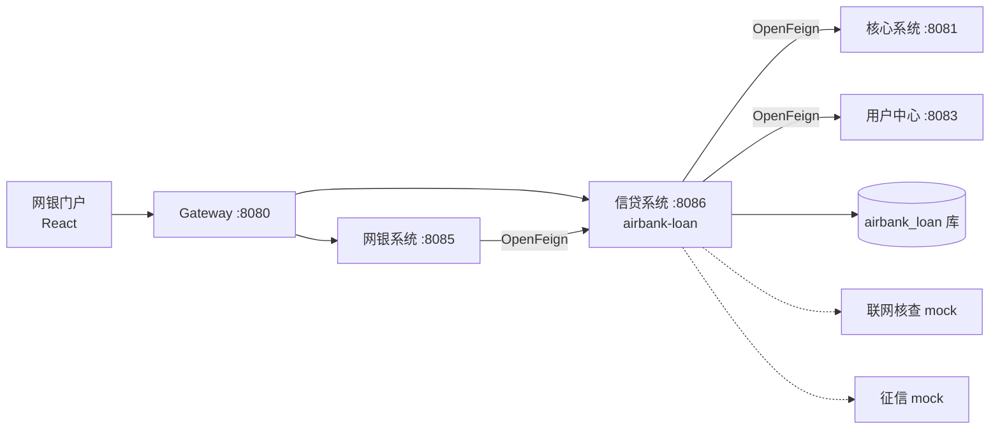

# 13. 小额信贷系统设计

> 版本 v1.0 · 状态：已实施
> 关联文档：[02 总体架构](02-总体架构设计.md)、[03 核心系统](03-核心系统业务设计.md)、[05 用户中心与渠道](05-用户中心与渠道设计.md)、[06 数据模型](06-数据模型设计.md)、[07 接口规范](07-接口设计与规范.md)

本文档描述在既有 5 服务架构上新增的**小额信贷子系统**：新增 `airbank-loan` 微服务（贷款产品/申请/审批/放款/还款/台账），
网银渠道（`airbank-ebank` + `airbank-ebank-web`）支持客户在线申请小额贷款；**联网核查**与**征信系统**两个外联依赖以 mock 实现。

## 1. 定位与范围

| 项 | 说明 |
|---|---|
| 业务定位 | 个人小额信用贷款：线上申请、自动审批、即刻放款、按月等额本息还款、支持提前结清 |
| 渠道 | 网上银行（客户自助，OTP 确认） |
| 外联 | ① 联网核查（公民身份信息一致性）② 个人征信报告查询 —— 均 mock，规则确定性可重复演示 |
| 资金 | 放款/还款统一走核心复式记账引擎（新增 3 个交易类型、2 个会计科目） |
| v1 简化 | 审批同步完成（无人工审批流）；无逾期批量/罚息计提；无柜面受理入口（预留） |

服务拓扑（增量部分）：

- `airbank-loan`：端口 **8086**，context-path `/api/loan`，独立库 `airbank_loan`（账号 `loan_app`），契约模块 `airbank-api-loan`。
- 工程结构与理财系统对齐：`entity / mapper / service / controller / integration / seed`。

## 2. 贷款产品

种子产品（`DataSeeder` 幂等写入）：

| 代码 | 名称 | 基准年利率 | 额度（元） | 期限（月） | 准入征信分 |
|---|---|---|---|---|---|
| LN001 | 极速信用贷 | 7.20% | 1,000 ~ 200,000 | 3/6/12/24/36 | 560 |
| LN002 | 消费分期贷 | 9.60% | 500 ~ 50,000 | 3/6/12/24 | 550 |
| LN003 | 经营周转贷 | 6.80% | 10,000 ~ 500,000 | 6/12/24/36 | 620 |

产品状态：`ON_SALE` / `OFF_SALE`；还款方式 v1 仅 `EQUAL_INSTALLMENT`（等额本息）。

## 3. 数据模型（airbank_loan 库）

DDL 见 `deploy/postgres/init/60-loan-schema.sql`。

| 表 | 说明 | 关键约束 |
|---|---|---|
| `t_loan_product` | 贷款产品 | `product_code` 唯一 |
| `t_loan_apply` | 贷款申请（含核查/征信/审批结论快照） | `apply_no`、`request_no` 唯一（幂等） |
| `t_loan_account` | 借据/台账 | `loan_no`、`apply_no` 唯一 |
| `t_loan_schedule` | 还款计划（逐期本金/利息） | `(loan_id, period_no)` 唯一 |
| `t_loan_repayment` | 还款记录 | `repay_no`、`request_no` 唯一（幂等） |
| `t_ext_check_log` | 外联查询留痕（mock 联网核查/征信的请求与应答全文） | — |
| 序列 `seq_apply/seq_loan/seq_repay` | 编号生成：申请 `LA`+日期+10 位；借据 `LN`+…；还款 `RP`+… | — |

状态机：

- 申请：`SUBMITTED → ID_CHECKED → CREDIT_CHECKED → APPROVED → DISBURSED`；旁路 `REJECTED`（核查/征信/审批拒绝）、`DISBURSE_FAILED`（核心放款明确拒绝）。
- 借据：`REPAYING → SETTLED`。
- 计划期次：`PENDING → PAID`；还款记录：`SUCCESS / FAILED`。

## 4. 核心流程

### 4.1 产品查询
`GET /api/loan/products?status=`、`GET /api/loan/products/{code}`（渠道经 `/api/ebank/loan/products` 编排）。

### 4.2 申请（同步四步）
`POST /api/loan/applications`（`LoanApplyCmd{requestNo, customerId, productCode, amount, termMonths, purpose, acctNo, channel, operator}`）：

1. **受理（幂等）**：`request_no` 重复 → 返回原申请；产品在售校验、金额区间校验、期限枚举校验 → 落单 `SUBMITTED`。
2. **联网核查**（§6.1）：不通过 → `REJECTED`；通过 → `ID_CHECKED`。
3. **征信查询**（§6.2）：→ `CREDIT_CHECKED`，快照 `credit_score`。
4. **自动审批**（§4.3）：通过 → `APPROVED` → **放款**；拒绝 → `REJECTED`（原因落 `reject_reason`）。
5. **放款**：调核心 `LOAN_DISBURSE`（幂等键=申请 `requestNo`）→ 本地事务开借据 + 生成等额本息计划 → `DISBURSED`。
   - 核心明确拒绝（`BizException`）→ 申请 `DISBURSE_FAILED` 并上抛 `8010`；
   - 其他异常（超时等）→ 申请保持 `APPROVED`，可按原 `requestNo` 安全重试。

### 4.3 自动审批规则
依序判定（命中即拒）：

| # | 规则 | 结论 |
|---|---|---|
| 1 | 征信白户（无记录） | 拒绝：暂无法授信 |
| 2 | 存在当前逾期 | 拒绝 |
| 3 | 历史逾期 ≥ 3 次 | 拒绝 |
| 4 | 近 6 个月查询 > 6 次 | 拒绝（多头借贷） |
| 5 | 征信分 < 产品准入分 | 拒绝 |

额度核定（通过时）：`批准额 = min(申请额, 产品上限, 征信分额度档)`；
档位：<600 分 → 5 万；<700 → 10 万；<800 → 20 万；≥800 → 不限。
批准额低于申请额 = **部分批准**；批准额低于产品起借额 → 拒绝。

风险定价（加点）：<650 分 +2.00%；<750 +1.00%；≥750 基准利率。

### 4.4 放款与还款计划（等额本息）
- 月供 = `P·r·(1+r)ⁿ / ((1+r)ⁿ−1)`，`r = 年利率/12`，分位四舍五入；
- 逐期 `利息 = 剩余本金×r`，`本金 = 月供 − 利息`，末期本金轧差结清（Σ本金 = 放款本金）；
- 应还日 = 放款日 + N 个月；放款日本日记入 `disburse_date`。

### 4.5 还款
`POST /api/loan/loans/repay`（`LoanRepayCmd{requestNo, loanNo, customerId, acctNo, repayMode, channel, operator}`）：

- `INSTALLMENT`：还最早未还一期（计划本金+利息）；`SETTLE`：提前结清 = 剩余本金 + 当期利息（剩余本金×月利率）。
- **金额由信贷系统权威计算**，渠道不传金额（防篡改）。
- 归属校验：仅借款人本人、且还款账户 = 放款账户。
- 核心记账拆两笔（同 `requestNo` 派生幂等键）：`requestNo+":P"` → `LOAN_REPAY_PRINCIPAL`，`requestNo+":I"` → `LOAN_REPAY_INTEREST`（利息为 0 跳过）。
- 核心明确拒绝（余额不足等）→ 还款记录 `FAILED` 并上抛 `8011`；成功 → 期次置 `PAID`、台账滚动（`remain_principal` 等），结清置 `SETTLED`。

### 4.6 查询
`GET /api/loan/applications?customerId=`、`GET /api/loan/applications/{applyNo}`、
`GET /api/loan/loans?customerId=`、`GET /api/loan/loans/{loanNo}`（台账+计划+还款记录）。

## 5. 与核心系统的资金交互

核心 `AccountingService` 新增交易类型与分录规格（Σ借=Σ贷 不变）：

| 交易类型 | 借方 | 贷方 | 账户侧 |
|---|---|---|---|
| `LOAN_DISBURSE` 放款 | 1221 个人小额贷款 | 2011 个人活期存款 | 客户活期 +（TO） |
| `LOAN_REPAY_PRINCIPAL` 还本 | 2011 个人活期存款 | 1221 个人小额贷款 | 客户活期 −（FROM） |
| `LOAN_REPAY_INTEREST` 付息 | 2011 个人活期存款 | 6021 利息收入-贷款利息 | 客户活期 −（FROM） |

新增科目（核心 `DataSeeder` 逐科目幂等补种，升级环境自动追加）：
`1221 个人小额贷款`（ASSET/DR）、`6021 利息收入-贷款利息`（INCOME/CR）。
利息收入记贷方符合损益类科目方向；日终 GL 汇总自动覆盖新科目，无需改批量。

## 6. 外联系统（mock 实现）

接口与实现分离：`IdentityCheckClient` / `CreditReportClient` 为外联契约，`@Primary` mock 实现可整体替换为真实前置。
所有查询（含 mock）均落 `t_ext_check_log`（请求/应答全文、结果、时间），满足审计与演示留痕。

### 6.1 联网核查 mock（`MockIdentityCheckClient`）
- 默认：姓名与证件号一致 → `PASS`；
- 培训触发词：姓名含 **“核查失败”** → `MISMATCH`（演示核查拒绝链路）。

### 6.2 征信 mock（`MockCreditReportClient`）
- 对同一客户**确定性**（`customerNo+idNo` 哈希）：征信分 560~920、近 6 月查询 0~3 次、偶发历史逾期 1 次、存量负债 0~49 万；
- 培训触发词：姓名含 **“逾期”** → 480 分 + 当前逾期（演示征信拒绝）；姓名含 **“白户”** → 无征信记录（演示白户拒绝）。

> 真实证件号不落库：mock 入参使用 UAM 脱敏证件号（`idNoMask`），联网核查请求仅记录前 4+后 4 掩码。

## 7. 网银渠道集成

后端编排（`airbank-ebank`，均限本人，OTP 场景 `LOAN`）：

| 端点（context-path `/api/ebank`） | 说明 |
|---|---|
| `GET /loan/products` | 在售产品 |
| `POST /loan/apply` | OTP → 本人活期 → 信贷申请；放款成功生成 `LOAN_DISBURSE` 回单 + 消息，拒绝落消息 |
| `GET /loan/applications` | 申请记录 |
| `GET /loan/loans`、`GET /loan/loans/{loanNo}` | 借据列表/详情（详情做本人归属校验） |
| `POST /loan/repay` | OTP → 还款（INSTALLMENT/SETTLE）；成功生成 `LOAN_REPAY` 回单 + 消息 |

前端（`airbank-ebank-web`）：菜单「贷款」→ **贷款超市**（产品卡片 + 申请向导：金额/期限/用途/授权勾选 → OTP → 结果弹窗含部分批准提示）
与 **我的贷款**（借据表 + 申请记录 Tab；详情抽屉展示还款计划与还款记录；还款弹窗支持还当期/提前结清）。

## 8. 部署与配置

| 项 | 变更 |
|---|---|
| Maven | 根 pom +`airbank-loan`；`airbank-api` +`airbank-api-loan`；`airbank-dependencies` 登记版本 |
| 数据库 | `60-loan-schema.sql`；`01-create-databases.sh` 注册 `airbank_loan`/`loan_app` |
| 网关 | 路由 `Path=/api/loan/** → lb://airbank-loan`；Nacos 白名单 +`/api/loan/internal/**` |
| Nacos | 新增 `airbank-loan.yaml`（日志级别，可热改） |
| Compose | 新增 `airbank-loan` 服务（8086，健康检查 `/api/loan/actuator/health`）；`airbank-ebank` 依赖 `airbank-loan` |
| 冒烟 | `scripts/smoke.sh` +`loan` 健康检查 |

## 9. 错误码（8000~ 段，已并入 `ErrorCodes`）

| 码 | 含义 | 码 | 含义 |
|---|---|---|---|
| 8001 | 贷款产品不存在 | 8007 | 借据不存在 |
| 8002 | 产品不可申请 | 8008 | 借据状态不允许 |
| 8003 | 借款金额不合法 | 8009 | 还款方式不合法 |
| 8004 | 借款期限不合法 | 8010 | 放款失败 |
| 8005 | 联网核查不通过 | 8011 | 还款失败 |
| 8006 | 征信审批拒绝 | 8012 | 申请状态不允许 |

## 10. 演示脚本（培训速查）

1. 网银登录（zhangsan / Abc12345）→「贷款 → 贷款超市」→ LN001 申请 ¥50,000 / 12 期 → OTP → 秒批放款；
2. 「我的贷款」查看借据与还款计划 →「还款 → 还当期」→ OTP → 回单/消息/账户流水三方可见；
3. 连续还 2 期后「提前结清」；
4. 故障演练：把还款账户余额花到不足 → 还款返回 `8011` 且台账不变；
5. mock 触发词（需配合 UAM 客户姓名造数）：姓名含“逾期/白户/核查失败”分别演示三类拒绝链路。
