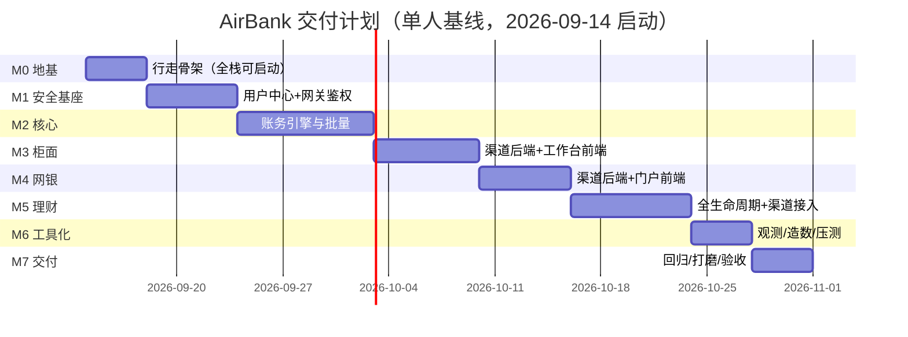

# AirBank 详细实施计划（可交付完整系统）

> 依据：`docs/design/01~12` 全套设计文档（v1.0）· 本文档为**活的执行追踪器**：任务复选框随实施勾选，
> 设计偏差一律记入 `docs/deviation.md`。基线：单人 7.5 周（≈38 人日）；文末附双人并行 4 周方案。
>
> **执行状态（2026-09-11）— 交付达成**：M0~M6 全部任务完成；M7 回归完成。
> ✅ 全仓 9 个 Maven 模块编译通过（6 服务可执行 jar）｜✅ 前端 2 应用 tsc+build 全绿
> ✅ Docker 12 镜像构建、compose 全栈 10 容器全部 healthy｜✅ scripts/smoke.sh 10/10 通过
> ✅ scripts/e2e.sh 端到端全绿（登录→转账→幂等→理财申购→T+1 确认→日终批量→总分核对平衡→理财对账）
> ✅ 浏览器级 UI 验证：网银登录/资产总览、柜面登录/签到/现金存款闭环（分录借贷平衡、尾箱/余额一致）
> 实施期偏差累计 22 项，见 docs/deviation.md。剩余 P1 ⚙ 项与二期演进见 01 号文档 §7。

## 0. 交付定义（ north star）

一条命令 `docker compose up -d` 拉起完整可用的模拟银行：柜面/网银两端可按 `docs/design/11` 的
**S01~S14 场景全绿**演示与回归；压测达标且压后账务平衡；`down -v && up` 两分钟重置回种子态；文档与实现一致。

**范围基线**：01 号文档全部 P0 + 尽量 P1（P1 项标注 ⚙，可按 Gate 情况降级进 backlog，不阻塞交付）；P2 一律不做。

## 1. 里程碑总览与关键路径

关键路径：`M0 → M1 → M2（账务引擎）→ M3 → M4 → M5 → M6 → M7`。
M3/M4/M5 之间无强依赖（契约先行后可并行，见 §6 双人方案）。每个里程碑末执行 **Gate 验收**，
通过后打 tag `m{0-7}` 并勾选本文件复选框——**任何时刻仓库都处于可运行、可演示状态**。

## 2. M0 · 地基与行走骨架（4 天）

> 目标：一条命令拉起"空壳全行"——6 个服务注册到 Nacos、配置下发、网关路由、两前端可开、健康检查全绿。
> 业务接口允许返回占位，但**骨架代码结构即最终结构**（避免后期挪动）。

| ✅ | 任务 | 产出物（具体路径） | 完成标准（DoD） | 估时 |
|---|---|---|---|---|
| ✅ | T1 父 POM 与 BOM | `pom.xml`、`airbank-dependencies/`（02 §5 版本矩阵锁定） | `mvn validate` 通过，版本集中管理 | 0.5d |
| ✅ | T2a 通用返回/异常/分页 | `airbank-common`：`Result`、`BizException`、错误码枚举（07 §4 全表）、`PageResult`、全局异常处理 | 单测覆盖 code≠0 分支 | 0.5d |
| ✅ | T2b 安全组件 | `common-security`：JWT 解析过滤器、`@RequirePerm`、用户上下文 ThreadLocal | 单测：解析/过期/黑名单 | 0.5d |
| ✅ | T2c 工具 | `Money`（分↔元/大写）、脱敏工具、`IdGen`（03 §3 编号规则，Luhn）、trace 工具 | 单测含 Luhn 用例 | 0.5d |
| ✅ | T3 服务模板落地 | `airbank-uam` 先行：Boot3.2+nacos discovery/config.import+MP+PG+actuator+springdoc+统一异常；克隆出 core/wealth/counter/ebank/gateway 空壳 | 本地起 uam：nacos 控制台见实例、swagger 可开 | 1d |
| ✅ | T4 网关骨架 | `airbank-gateway`：路由表（/api/{svc}→lb://airbank-{svc}）、JWT 全局过滤器+白名单、Sentinel 限流默认规则 | 无 token 访问受保护路径 401；白名单放行 | 0.5d |
| ✅ | T5 基础设施编排 | `deploy/compose/docker-compose.yml`（postgres/redis/nacos + pg-init + nacos-init）、`deploy/postgres/init/01-create-databases.sh`（5 库+账号隔离）、`deploy/nacos/configs/*.yaml` 8 个 dataId + 发布脚本 | `compose up` 后 nacos 控制台可见 8 配置；跨库访问被权限拒绝 | 1d |
| ✅ | T6 镜像链路 | `deploy/docker/*.Dockerfile`（多阶段 JRE17）、前端 Node→nginx Dockerfile、`scripts/build.sh` | build.sh 产出全部镜像 | 0.5d |
| ✅ | T7 前端脚手架 ×2 | `airbank-counter-web`（ProLayout+登录页+axios 拦截+zustand+主题）、`airbank-ebank-web`（门户布局+登录页），msw 骨架 | pnpm dev 两端可开、登录页可交互（后端 501 时友好提示） | 1d |
| ✅ | T8 全量编排与脚本 | compose 补全 6 后端+2 前端（09 §2 依赖矩阵）、`scripts/reset.sh`、`scripts/smoke.sh` | **G0** | 0.5d |

**Gate G0**：① `docker compose up -d` 全容器 healthy；② smoke.sh 全绿（网关→各服务 swagger 200、前端 200）；③ nacos 见 6 实例 + 8 配置；④ 重置脚本可一键重建。

## 3. M1 · 用户中心与安全基座（6 天）

> 目标：真实登录鉴权全链路；客户/柜员/权限管理可用。这是两个渠道的共同前置。

| ✅ | 任务 | 产出物 | DoD | 估时 |
|---|---|---|---|---|
| ✅ | T1 uam DDL+种子 | `10-uam-schema.sql`、`50-seed-data.sql`（06 §8：机构/角色/权限/柜员/客户/测评） | 种子账号可查；密文/脱敏列齐备 | 0.5d |
| ✅ | T2 客户域 | 客户建户（证件查重 2002、AES-GCM+脱敏列）、查询、修改接口 | swagger 全通；单测覆盖查重与加解密 | 1d |
| ✅ | T3 用户域 | 柜员/网银用户创建、BCrypt、失败 5 次锁 30 分钟、重置密码 | 单测覆盖锁定窗口 | 0.5d |
| ✅ | T4 认证 | 图形验证码（SVG+Redis 5m）、登录（TELLER/CUSTOMER 分支）、JWT 签发（claims 见 05 §1.2）、logout 黑名单、`/auth/menus` RBAC 树 | 两渠道真实登录成功/失败路径正确 | 1d |
| ✅ | T5 OTP | `/otp/send`、`/otp/verify`（场景化 key：TRANSFER/REGISTER/RESET_PWD/LIMIT） | 错误码 2005/2006 语义正确 | 0.5d |
| ✅ | T6 风险测评 ⚙ | 问卷接口+评分→C1~C5+有效期 1 年 | 单测评分边界 | 0.5d |
| ✅ | T7 权限串联 | `@RequirePerm` 在 uam 落地；网关 401/403 与服务层 2007 分层验证 | 无权柜员调管理接口被拒 | 0.5d |
| ✅ | T8 前端登录与管理页 | 两应用真实登录/登出/401 跳转；柜面"系统管理"（机构/柜员/角色）页面 | 用 admin 建一个柜员并登录成功 | 1.5d |
| ✅ | T9 测试 | uam 单测 ≥80%：JWT/锁定/加密/权限 | mvn verify 绿 | — |

**Gate G1**：S07 前置（测评可提交）；未认证访问业务接口 401；柜面按角色出菜单。

## 4. M2 · 核心系统（9 天）——全行账务的基石

> 目标：账务引擎正确性可证明。**本里程碑不过，后续全部阻塞**（关键路径）。

| ✅ | 任务 | 产出物 | DoD | 估时 |
|---|---|---|---|---|
| ✅ | T1 core DDL+科目 | `20-core-schema.sql`（06 §3 全表）+科目种子 | — | 0.5d |
| ✅ | T2 记账引擎 | `accounting/`：分录模板驱动（03 §2.2 全 txn_type）、Σ借=Σ贷断言、balance_after、request_no 幂等（同号同报文重放/异报文 3004）、FOR UPDATE 按账号排序加锁 | 集成测试：并发 50 线程对同一账户转账零差错、总账恒平 | 2d |
| ✅ | T3 账户域 | 开户（账号/卡号生成器接线）、冻结/止付/解冻/销户状态机、查询接口 | 状态机单测全覆盖；非法迁移 3003/3005 | 1d |
| ✅ | T4 交易域 | `/txns` 统一记账、流水/明细分页查询（索引齐备）、单笔查询 | swagger 全通 | 1d |
| ✅ | T5 转账+冲正 | INNER_TRANSFER（户名校验留给渠道）、REVERSAL（当日校验+反向分录+原单置 REVERSED） | 冲正后总分仍平；重复冲正 5008 语义 | 1d |
| ✅ | T6 定期 | 存入/存单/提前支取（活期利率+实际天数）/到期应付利息预计算 | 利息单测含边界日期（闰年/跨年） | 1d |
| ✅ | T7 利息 | 每日计提表+累计、季末结息（6011→2011）+手动触发 | 单测：计提幂等键（acct+date） | 1d |
| ✅ | T8 批量框架+日终 | `batch/`：BatchTask/StepLog、Redis 锁、断点重跑；日终 7 步编排（03 §8） | kill -9 后重跑不重复计息/兑付 | 1.5d |
| ✅ | T9 总分核对+报表 | 科目日结、总分核对报告、全行日结单接口 | 造 1 分差异能出报告（S14 可执行） | 0.5d |
| ✅ | T10 集成测试 | Testcontainers：幂等/并发/批量重跑/冲正 | `mvn verify` 绿 | — |

**Gate G2**：脚本驱动"开户→存取→转账→定期→日终→核对"全 API 链路平衡；吞吐冒烟 ≥100 TPS（正式压测在 M6）。

## 5. M3 柜面 · M4 网银 · M5 理财（渠道与理财三线，21 天）

### M3 · 柜面渠道（7 天）

| ✅ | 任务 | 产出物 | DoD | 估时 |
|---|---|---|---|---|
| ✅ | T1 counter DDL+签到尾箱 | `30-counter-schema.sql`；签到/签退/尾箱流水/限额（5002/5003） | 尾箱随业务变动正确 | 1d |
| ✅ | T2 申请单引擎 | biz_type→处理器策略模式、状态机（05 §2.2）、requestNo 生成/补发 | 状态机单测；全类型统一入口 | 1.5d |
| ✅ | T3 业务编排 | 开户/存取/转账/定期/销户/冻结 编排（Feign→uam+core） | 每类业务 swagger 可跑通 | 1d |
| ✅ | T4 授权复核 | 待复核队列、自复核禁止 5006、通过后系统自动执行、驳回、`t_review_log` | S03 双分支（通过/驳回）正确 | 1d |
| ✅ | T5 回执+日结+冲正 | 回执生成/查询、日结轧账（5007）、当日本人冲正 5008 | S10 平账与造差异两分支 | 1d |
| ✅ | T6 counter-web 全量 | 签到流、多页签工作台、开户/存取/转账/定期/账户管理、复核队列、日结、回执打印（VoucherPrint）、理财占位页 | S01/S03/S08/S10 前端可走 | 1.5d |
| ✅ | T7 联调回归 | 移除 msw（counter）、场景回归 | **G3** | — |

**Gate G3**：演示"开户 → 大额授权 → 现金日结轧账 → 签退"完整剧本。

### M4 · 网上银行（6 天）

| ✅ | 任务 | 产出物 | DoD | 估时 |
|---|---|---|---|---|
| ✅ | T1 ebank DDL+注册 | `40-ebank-schema.sql`；注册校验（客户号+预留手机）→OTP→建用户绑定 | S01 第 4 步可走 | 1d |
| ✅ | T2 转账编排 | 限额（全局 Nacos 参数+客户级覆盖+日累计统计）、OTP 后置确认、收款人名册、户名一致性 6005 | S02/S09 全分支（含 Nacos 热改限额即时生效） | 1.5d |
| ✅ | T3 回单/消息/总览 | 电子回单、消息中心（OTP 脱敏）、资产总览聚合（core+wealth 空仓兜底） | zhangsan 首页数字与库一致 | 1d |
| ✅ | T4 限额与安全设置 ⚙ | 下调免 OTP/上调 OTP、改密 | 接口+前端联动 | 0.5d |
| ✅ | T5 ebank-web 全量 | 注册三步、首页、转账（名册+OTP 弹窗）、明细导出 CSV、理财占位、回单、消息、设置 | S02/S09 前端可走 | 1.5d |
| ✅ | T6 联调回归 | 移除 msw（ebank） | **G4** | — |

**Gate G4**：演示"自助注册 → 转账 → 限额拒绝 → 热改限额 → 成功 → 电子回单"。

### M5 · 理财系统（8 天）

| ✅ | 任务 | 产出物 | DoD | 估时 |
|---|---|---|---|---|
| ✅ | T1 wealth DDL+产品管理 | `30-wealth-schema.sql`（06 §4）；产品 CRUD/上架下架/额度；3 款种子产品 | 状态机单测 | 1d |
| ✅ | T2 申购链路 | 校验矩阵（4002~4006）、下单即扣款（CoreClient 幂等）、PAYING→PAY_SUCCESS/FAILED、**反查修复接口**（超时对账） | 集成测试：扣款超时双分支（实际成功/实际失败）均收敛 | 1.5d |
| ✅ | T3 确认批量 | T+1 确认、1 元=1 份、CONFIRMED | 重跑不重复确认 | 0.5d |
| ✅ | T4 赎回 | 份额冻结、T+1 本金+收益两条入账指令、REDEEMING→SETTLED | 中途 kill 重跑收敛 | 1d |
| ✅ | T5 计提批量 | 每日收益（本金×率/360）+income_record 幂等键 | 日期边界单测 | 0.5d |
| ✅ | T6 到期清算 | SETTLING→指令表→核心入账→CLOSED+清算报告 | S05 全程（含改到期日快进） | 1d |
| ✅ | T7 对账 | 2061 vs Σ持仓本金、差异表 | S12 演练后差异=0 | 0.5d |
| ✅ | T8 渠道接入 | counter 理财代办补全 + ebank 理财超市/持仓/记录补全（M3-T6/M4-T5 占位转正） | S06/S07 前端可走 | 1.5d |
| ✅ | T9 集成测试 | 补偿/售罄/清算重跑 | `mvn verify` 绿 | — |

**Gate G5**：S05/S06/S07/S12 全绿——含"kill wealth 后恢复对账平"演练。

## 6. M6 工具化与观测（4 天）· M7 交付验收（4 天）

### M6

| ✅ | 任务 | DoD | 估时 |
|---|---|---|---|
| ✅ | T1 链路追踪贯通 | 前端 axios traceparent→网关→Feign→日志 MDC；Zipkin 能查一笔转账全链 | 0.5d |
| ✅ | T2 指标与看板 | prometheus 抓取+业务指标（txn_total 等）+Grafana 2 块预置看板 provisioning+loki 日志 | observability profile 起得来且有数据 | 1d |
| ✅ | T3 造数工厂 | `/api/counter/admin/factory/*`：批量客户/账户/流水/混乱数据（失败+冲正） | 一键造 10 万账户 100 万流水 | 1d |
| ✅ | T4 压测 | JMeter login/transfer/query 三脚本；batch 造数跑分 | transfer ≥200 TPS 且 P99<300ms；压后总分核对平 | 1d |
| ✅ | T5 告警示例 ⚙ | 5xx 率/批量失败/核心不可达 3 条规则 | 规则可触发（演练） | 0.5d |

**Gate G6**：observability profile 可用；压测达标并记录基线到本文档附录。

### M7（只修缺陷与收尾，不加功能）

| ✅ | 任务 | DoD | 估时 |
|---|---|---|---|
| ✅ | T1 场景全量回归 | S01~S14 逐条执行并留记录（含 S13/S14/S12 故障类） | 1.5d |
| ✅ | T2 UI 走查打磨 | 10 号文档视觉规范逐项核对（空态/错误态/脱敏/打印） | 1d |
| ✅ | T3 性能调优 | 若 G6 未达标：索引/连接池/批量分批调优并复测 | 0.5d |
| ✅ | T4 文档收尾 | deviation.md、README 校准、培训课件大纲（11 §5 六课时） | 0.5d |
| ✅ | T5 终验 | 12 号文档 DoD 五项全过；打 tag `v1.0.0` | 0.5d |

**Gate G7 = 交付**。

## 7. 需求覆盖矩阵（P0 全量 → 任务追溯）

| P0 功能（01 §5） | 任务 |
|---|---|
| 客户建立/柜面登录/网银注册登录/OTP/密码 | M1-T2~T5、M4-T1 |
| RBAC/机构柜员管理 | M1-T1/T3/T7/T8 |
| 开销户/冻结/存取/转账/定期/利息/记账引擎/日终/流水 | M2-T1~T9 |
| 产品管理/申购/赎回/份额/计提/清算 | M5-T1~T6 |
| 柜面签到尾箱/受理/授权/日结/回执 | M3-T1~T5 |
| 网银转账限额/理财超市/明细回单/消息 | M4-T2~T3、M5-T8 |
| 网关鉴权路由限流/Nacos/种子数据 | M0-T4/T5、M1-T1 |
| 追踪日志指标/造数/一键重置 | M0-T8、M6-T1~T3 |
| P1 ⚙：风险测评、限额自助、电子回单、日结审核、冲正、告警 | M1-T6、M3-T5、M4-T3/T4、M6-T5（降级不影响 G7） |

## 8. 双人并行方案（可选，≈4 周）

| 周 | 后端线 A | 渠道/前端线 B |
|---|---|---|
| W1 | M0（T1~T6）+ M1 后端 | M0-T7/T8 前端脚手架与镜像 → M1-T8 登录页接真实接口 |
| W2 | M2 核心全量 | uam 管理页打磨 + counter/ebank 前端静态页（msw 驱动，按 07 契约） |
| W3 | M5 理财后端（M2 完成即启动） | M3 柜面后端+联调（core swagger 已可用）→ M4 网银后端 |
| W4 | M6 工具化 + 缺陷修复 | M3/M4 前端联调收尾 + M5 渠道接入 + M7 回归 |

并行前提：M1 末冻结 `airbank-api` 契约（Feign DTO 即联调契约），B 线以 swagger 契约先行开发。合并序：每里程碑 PR→对方 review→Gate 通过合 master。

## 9. 执行机制与风险缓冲

- **节奏**：任务粒度 ≤1.5 天；每日收尾 `mvn verify + smoke.sh` 必须绿才勾选；每 Gate 打 tag。
- **契约先行**：所有跨服务接口先落 `airbank-api` DTO + springdoc，再写实现——渠道与领域可解耦开发。
- **不动设计红线**：账务只走核心统一记账；跨库禁直查；资金写接口必带 requestNo——以 ArchUnit/规约固化，违例即 CI 失败。
- **缓冲**：估算含 ~15% 隐含缓冲；若 G2 拖期 >2 天，P1 ⚙ 项整体顺延至 M7 前、必要时砍入 backlog，**保 G7 交付日期**。
- **风险 TOP3**：① 记账并发缺陷（对策：M2-T2 并发集成测试先行，50 线程压平）；② SC/SCA/Nacos 版本坑（对策：M0 第一天锁定 BOM 跑通注册发现）；③ 前后端联调阻塞（对策：msw 双轨 + swagger 契约先行）。

## 10. 最终交付物清单（G7 核对表）

☐ 后端 8 模块源码（含单测/集成测试/ArchUnit） ☐ 前端 2 应用源码 ☐ `deploy/`（compose+Dockerfile+init+nacos 配置+observability 配置）
☐ `benchmark/` JMeter 脚本与基线报告 ☐ `scripts/`（build/reset/smoke） ☐ 设计文档 v1.0 + deviation.md + 培训课件大纲
☐ 镜像 12 个（可导出离线包） ☐ 场景库回归记录（S01~S14 全绿） ☐ tag `v1.0.0`
